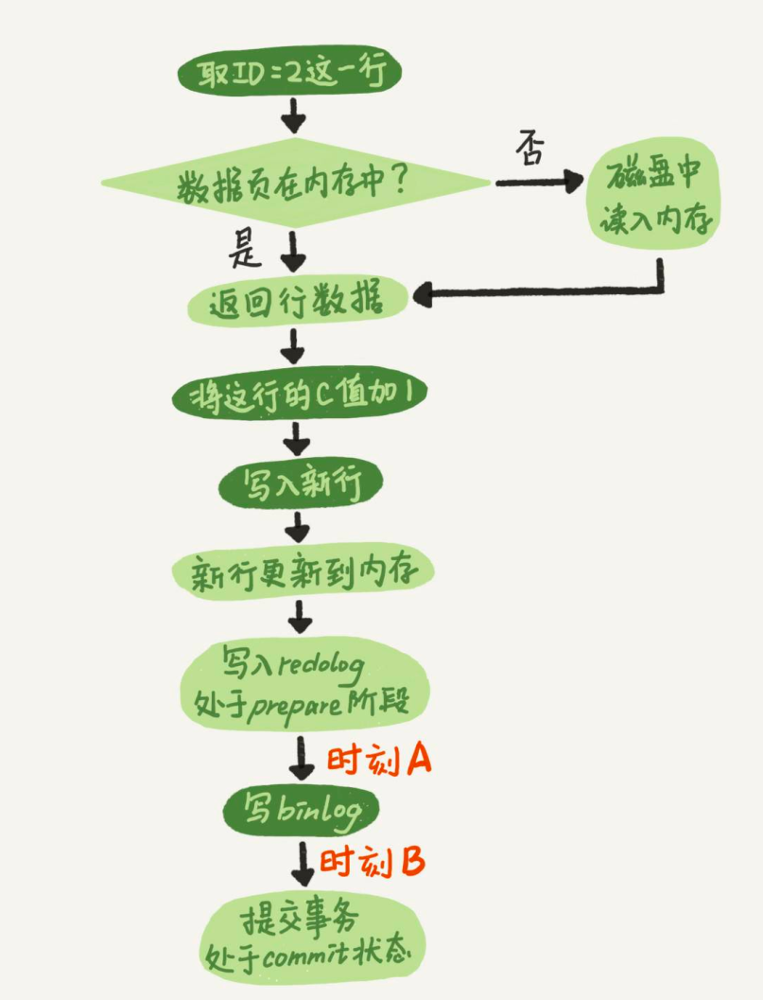

# MySql日志文件

MySQL整体来看，其实就有两块： 一块是Server层，它主要做的是MySQL功能层面的事情； 还有一块是引擎层，负责存储相关的具体事宜。

MySql在Server层面有binlog、error log、slow log、relay log

* binlog： 数据恢复 + 主从复制
* error log：错误信息的日志
* slow log：记录慢sql
* relay log：用于从库接收主库的binlog

InnoDB存储引擎层面主要有两种日志，一种是redo日志，一种是undo日志。

* redo log：高性能写入 + 数据恢复
* undo log：回滚 + 多版本控制（MVCC）

## binlog 
binlog
/ˈbaɪnəri/

* 完成主从复制。主服务器上修改话剧的操作都会记录到binlog中
* 进行恢复操作。数据可以通过binlog日志，使用mysqlbinlog命令，基于某个时间和位置去恢复。

### 开启binlog
* 在配置文件中
```text
log_bin = ON
```
mysql5.7是默认关闭，mysql8.0是默认开启的

### binlog 写入机制
> binlog 写入的顺序

每个线程有自己binlog cache，但是共用同一份binlog文件。

1. binlong日志 写入binlog cache
2. 日志写入到文件系统的page cache，并没有把数据持久化到磁盘，所以速度比较快。
3. 数据持久化到磁盘

> 参数sync_binlog 来控制写入策略

0: 表示每次提交事务都只调用write写入到page cache，不持久化磁盘（fsync）

1：表示每次提交事务都会执行fsync

N：表示每次提交事务都write，但累积N个事务后才fsync

### binlog 的三种格式
MySQL 的 binlog（二进制日志）有三种格式：statement、row 和 mixed。

Statement 格式：MySQL 将每个执行的 SQL 语句记录到 binlog 中。

Row 格式：MySQL 将每个修改前后的行数据都记录到 binlog 中。

Mixed 格式：Statement 格式和 Row 格式的混合使用。

### 查看binlog相关配置和存放地址的命令
```text
mysql> show variables like '%log_bin%';
+---------------------------------+-----------------------------+
| Variable_name                   | Value                       |
+---------------------------------+-----------------------------+
| log_bin                         | ON                          |
| log_bin_basename                | /var/lib/mysql/binlog       |
| log_bin_index                   | /var/lib/mysql/binlog.index |
| log_bin_trust_function_creators | OFF                         |
| log_bin_use_v1_row_events       | OFF                         |
| sql_log_bin                     | ON                          |
+---------------------------------+-----------------------------+
```
* 到对应目录中查看
```text
bash-4.4# ls | grep bin
binlog.000001
binlog.000002
binlog.index
```
binlog.000001和binlog.000002 是binlog文件，binlog.index 是binlog的索引文件，用来记录产生的二进制日志的序号
```text
bash-4.4# cat binlog.index 
./binlog.000001
./binlog.000002
```
* 在命令行查看binlog文件
```text
show binary logs;
```
```text
+---------------+-----------+-----------+
| Log_name      | File_size | Encrypted |
+---------------+-----------+-----------+
| binlog.000001 |   3039831 | No        |
| binlog.000002 |       157 | No        |
+---------------+-----------+-----------+m
```
* 在命令行查看MySql当前的日志和状态
```text
show master status;
```
```text
mysql> show master status;
+---------------+----------+--------------+------------------+-------------------+
| File          | Position | Binlog_Do_DB | Binlog_Ignore_DB | Executed_Gtid_Set |
+---------------+----------+--------------+------------------+-------------------+
| binlog.000002 |      157 |              |                  |                   |
+---------------+----------+--------------+------------------+-------------------+
```
当前使用的binlog文件是binlog.000002，文件偏移量是157个字节


### 如何看binlog日志
#### 使用mysqlbinlog命令
```text
/usr/local/mysql/bin/mysqlbinlog -v --base64-output=decode-rows binlog.000001 > bin.log
```
--base64-output：将二进制文件输出格式为 Base64 编码。  
-v 代表可以看到具体的执行信息

eg: 新建一个表,使用命令查看binlog文件
```text
mysqlbinlog -v --base64-output=decode-rows binlog.000002 > bintest2.log
```
```text
SET TIMESTAMP=1692178051/*!*/;
/*!80013 SET @@session.sql_require_primary_key=0*//*!*/;
CREATE TABLE students (
  id INT AUTO_INCREMENT,
  name VARCHAR(50) NOT NULL,
  age INT,
  CONSTRAINT pk_students PRIMARY KEY (id)
) ENGINE=InnoDB
/*!*/;
# at 1239
#230816  9:30:50 server id 1  end_log_pos 1318 CRC32 0xcce4a335 	Anonymous_GTID	last_committed=4	sequence_number=5	rbr_only=yes	original_committed_timestamp=1692178250870308	immediate_commit_timestamp=1692178250870308	transaction_length=297
/*!50718 SET TRANSACTION ISOLATION LEVEL READ COMMITTED*//*!*/;
```

eg: 插入一条数据,使用命令查看binlog文件
```text
mysql> insert into students (name,age) values('dick', 17);
Query OK, 1 row affected (0.01 sec)

mysql> select * from students
    -> ;
+----+------+------+
| id | name | age  |
+----+------+------+
|  1 | dick |   17 |
+----+------+------+
```
```text
BEGIN
/*!*/;
# at 1393
#230816  9:30:50 server id 1  end_log_pos 1456 CRC32 0x35771552 	Table_map: `test`.`students` mapped to number 92
# has_generated_invisible_primary_key=0
# at 1456
#230816  9:30:50 server id 1  end_log_pos 1505 CRC32 0x97edcece 	Write_rows: table id 92 flags: STMT_END_F
### INSERT INTO `test`.`students`
### SET
###   @1=1
###   @2='dick'
###   @3=17
# at 1505
#230816  9:30:50 server id 1  end_log_pos 1536 CRC32 0x2660ded4 	Xid = 29
COMMIT/*!*/;
```

eg: 更新一条数据,使用命令查看binlog文件
```text
mysql> update students set age = 25 where id = 1;
Query OK, 1 row affected (0.01 sec)
Rows matched: 1  Changed: 1  Warnings: 0

mysql> select * from students;
+----+------+------+
| id | name | age  |
+----+------+------+
|  1 | dick |   25 |
+----+------+------+
```
```text
BEGIN
/*!*/;
# at 1699
#230816  9:36:26 server id 1  end_log_pos 1762 CRC32 0x3b636dcd 	Table_map: `test`.`students` mapped to number 92
# has_generated_invisible_primary_key=0
# at 1762
#230816  9:36:26 server id 1  end_log_pos 1826 CRC32 0x06550163 	Update_rows: table id 92 flags: STMT_END_F
### UPDATE `test`.`students`
### WHERE
###   @1=1
###   @2='dick'
###   @3=17
### SET
###   @1=1
###   @2='dick'
###   @3=25
# at 1826
#230816  9:36:26 server id 1  end_log_pos 1857 CRC32 0x8a6e101a 	Xid = 31
COMMIT/*!*/;
SET @@SESSION.GTID_NEXT= 'AUTOMATIC' /* added by mysqlbinlog */ /*!*/;
DELIMITER ;
# End of log file
```

通过三个例子可以看到 在 Row 格式下，MySQL 将每个修改前后的行数据都记录到 binlog 中。

### 涉及binlog的相关参数
#### max_binlog_size
````text
mysql> show variables like 'max_binlog_size';
+-----------------+------------+
| Variable_name   | Value      |
+-----------------+------------+
| max_binlog_size | 1073741824 |
+-----------------+------------+
````
该参数制定了点那个binlog的最大值。如果超过该值就会自动生产新的binlog文件，重启MySql实例也会生成新的binlog。默认值是1GB

生产环境一般控制binlog的生产时间最小间隔保持在2～5分钟，参数不要太大，可以设置为256MB
#### binlog_cache_size
```text
mysql> show variables like 'binlog_cache_size';
+-------------------+-------+
| Variable_name     | Value |
+-------------------+-------+
| binlog_cache_size | 32768 |
+-------------------+-------+
```
所有未提交的事务会记录到一个缓存中，等待事务提交时，直接将缓存中的二进制日志写入到binlog中。  
该缓存由binlog_cache_size决定，默认是32KB。    
基于会话，一个线程开始一个事务，MySql就会自动分配一个该值大小的缓存。  
该值太小，就会使用磁盘上临时文件来记录。
```text
mysql> show global status like '%binlog_cache%';
+-----------------------+-------+
| Variable_name         | Value |
+-----------------------+-------+
| Binlog_cache_disk_use | 0     |
| Binlog_cache_use      | 0     |
+-----------------------+-------+
```
使用show global status like '%binlog_cache%' 查出Binlog_cache_disk_use=0 说明没有使用磁盘文件

#### expire_logs_days
binlog过期时间，单位是天
```text
mysql> show variables like '%expire_logs_days%';
+------------------+-------+
| Variable_name    | Value |
+------------------+-------+
| expire_logs_days | 0     |
+------------------+-------+
```

## slow log
慢查询日志（slow log）
```text
mysql> show variables like '%slow%';
+-----------------------------+--------------------------------------+
| Variable_name               | Value                                |
+-----------------------------+--------------------------------------+
| log_slow_admin_statements   | OFF                                  |
| log_slow_extra              | OFF                                  |
| log_slow_replica_statements | OFF                                  |
| log_slow_slave_statements   | OFF                                  |
| slow_launch_time            | 2                                    |
| slow_query_log              | OFF                                  |
| slow_query_log_file         | /var/lib/mysql/306c86313d43-slow.log |
+-----------------------------+--------------------------------------+
```

## redo log
MySQL里经常说到的WAL技术，WAL的全称是WriteAheadLogging，它的关键点就是先写日志，再写磁盘，也就是先写粉板，等不忙的时候再写账本。

* 当有一条记录需要更新的时候，InnoDB引擎先把记录写到redo log（粉板），并更新内存，这个时候更新就算完成了。InnoDB引擎会在适当的时候，将这个操作记录更新到磁盘里面。

* InnoDB的redo log是固定大小的。比如可以配置为一组4个文件，每个文件的大小是1GB，那么这块“粉板”总共就可以记录4GB的操作。 从头开始写，写到末尾就又回到开头循环写。

### redo log buffer
redo log buffer就是一块内存，用来先存redo日志的。 在执行事务的时候，如insert、update会先存在buffer中。等事务commit，再一起写入redo log

### redo log 实际的写入时机


> redo log写入的顺序

1. 先存到redo log buffer（物理上存到MySql进程内存）
2. 写到磁盘（write）但是没有持久化（fsync）。
    物理上是文件系统的page cache中
3. 持久到磁盘 也就是 hard disk


> InnoDB提供了innodb_flush_log_at_trx_commit参数 来控制写入策略

0：每次提交事务时，只把redo日志留在redo log buffer中

1：每次提交事务时，把redo日志持久化到磁盘

2：每次提交事务时，把redo日志提交到page cache中

> redo log写盘的三种情况

1. InnoDB有一个后台线程，每隔1秒，把redo log buffer中的日志，调用write写到文件系统的page cache，然后调用fsync持久化到磁盘。
2. redo log buffer占用的空间即将达到 innodb_log_buffer_size一半的时候，后台线程会主动写盘。
3. 并行的事务提交的时候，顺带将这个事务的redo log buffer持久化到磁盘

## undo log
在数据修改的时候，不仅记录了redo log，还记录undo log。如果因为某些原因导致事务失败或回滚了，可以用undo log进行回滚。

undo log主要有两个作用：回滚和多版本控制(MVCC)

1. 保证事务进行rollback时的原子性和一致性。
```text
undo log主要存储的也是逻辑日志。
比如我们要insert一条数据了，那undo log会记录一条对应的delete日志。
我们要update一条记录时，它会记录一条对应相反的update记录。
```
2. 用于MVCC快照读的数据
```text
在MVCC多版本控制中，通过读取undo log的历史版本数据可以实现不同事务版本号都拥有自己独立的快照数据版本。
```


## crash-safe
redo log用于保证crash-safe能力。

innodb_flush_log_at_trx_commit = 1，表示每次事务的redo log都直接持久化到磁盘，这样可以保证 MySQL异常重启之后数据不丢失。

sync_binlog = 1，表示每次事务的binlog都持久化到磁盘。这样可以保证MySQL异常重启之后binlog不丢失。

这就是通常说的MySQL的“双1”配置，指的就是sync_binlog和innodb_flush_log_at_trx_commit都设 置成 1。也就是说，一个事务完整提交前，需要等待两次刷盘，一次是redo log（prepare 阶段），一次是binlog。

## 两阶段提交


在 MySQL 中，两阶段提交主要用于保证 redo log 和 binlog 的状态保持逻辑上的一致。具体来说，MySQL 在执行事务时会将相关的操作记录到 redo log 中，以确保事务的持久性和原子性。同时，MySQL 还会将 binlog 用于复制和恢复操作的记录。

在两阶段提交协议的第一阶段，MySQL 会将 redo log 的状态记录到事务状态表（Transaction Status Table）中，并生成一个全局事务标识（Global Transaction Identifier，简称 GTID）。在第二阶段，MySQL 会根据事务状态表中的信息，进行最终的事务提交或回滚操作，并同时更新 binlog 的状态。

redo log 记录了数据的物理变化，而 binlog 记录了 SQL 语句的逻辑操作

### 崩溃恢复时的判断规则:
1. 如果redo log里面的事务是完整的，也就是已经有了commit标识，则直接提交；
2. 如果redo log里面的事务只有完整的prepare，则判断对应的事务binlog是否存在并完整：
  
    2.1 如果是，则提交事务；

    2.2 否则，回滚事务。

一个事务的binlog是有完整格式的：
row格式的binlog，最后会有一个XID event。

### 为何设计两阶段提交?
redo log 日志在innodb引擎端，而binlog在server层。涉及到两个不同服务的交互，又要保证数据一致性问题，这就是一个典型的分布式问题。
2PC保证了事务在引擎层（redo）和server层（binlog）之间的原子性。其中binlog作为XA协调器，即以binlog是否成功写入磁盘作为事务提交的标志（innodb commit标志并不是事务成功与否的标志）


##  为什么需要binlog和redo log

1. 只使用binlog的话，无法保证InnoDB的崩溃恢复。
```text
MySql之前原生支持的是MyISAM，设计之初就有没有支持崩溃恢复。

binlog没有能力恢复“数据页”。binlog write这个位置发生崩溃的话，之前的事务1也是可能丢失了的，而且是数据页级的丢失。因为binlog只记录了SQL语句，而不像WAL日志那样记录每个数据页的变更。
```

2. 只使用redo log，可以保证crash-safe。
## binlog和redo log比较
1. redo log是InnoDB引擎特有的； binlog是MySQL的Server层实现的，所有引擎都可以使用。

2. redo log是物理日志，记录的是“在某个数据页上做了什么修改”； binlog是逻辑日志，记录的sql语句和前后值的变化。

3. redo log是循环写的，空间固定会用完； binlog是可以追加写入的。

4. 事务提交的时候，一次性将事务中的sql语句（一个事物可能对应多个sql语句）按照一定的格式记录到binlog中。这里与redo log很明显的差异就是redo log并不一定是在事务提交的时候刷新到磁盘，redo log是在事务开始之后就开始逐步写入磁盘。


