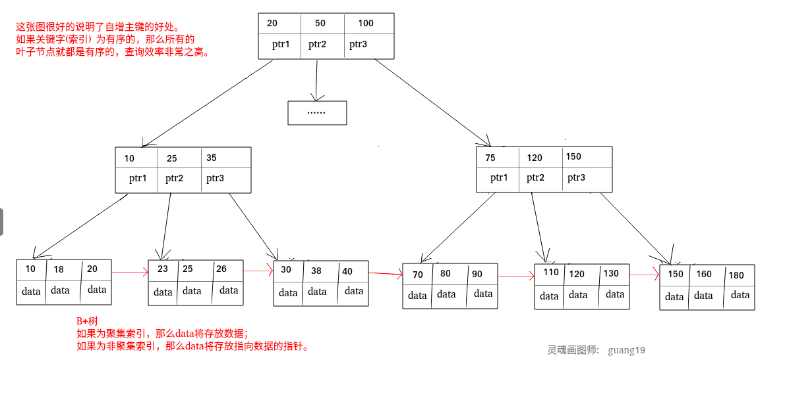
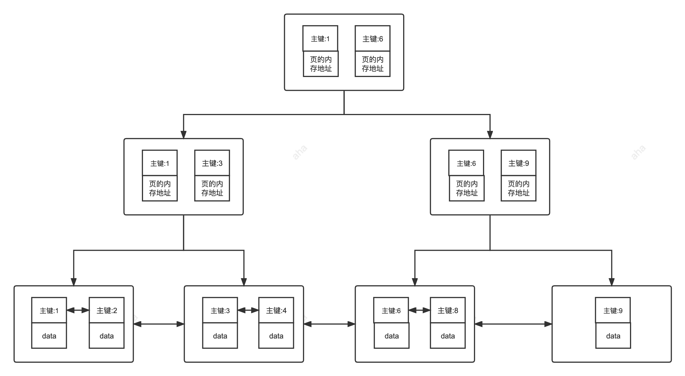
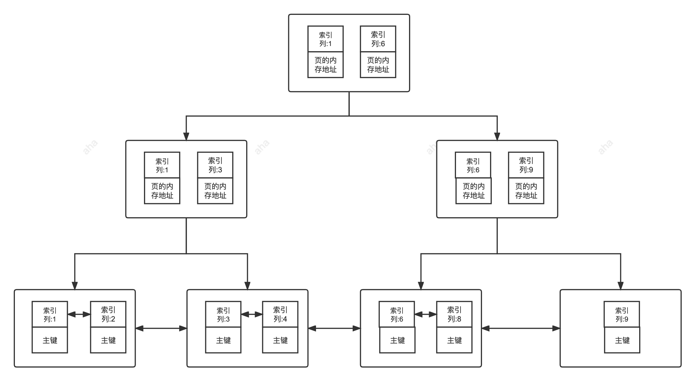
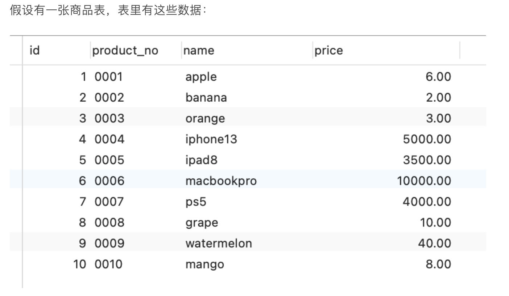
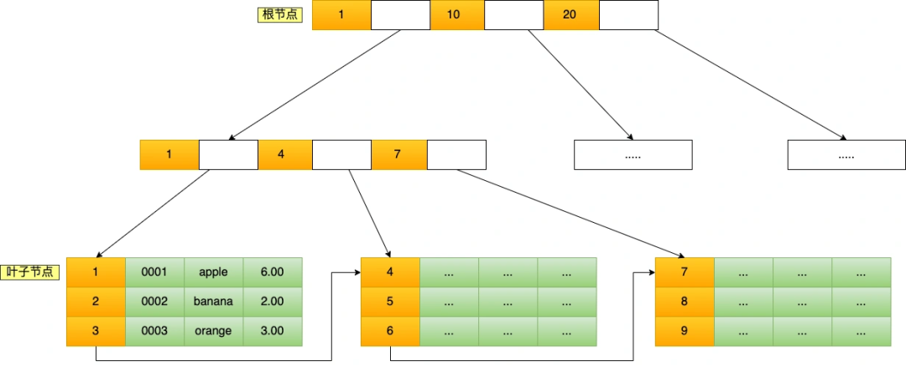
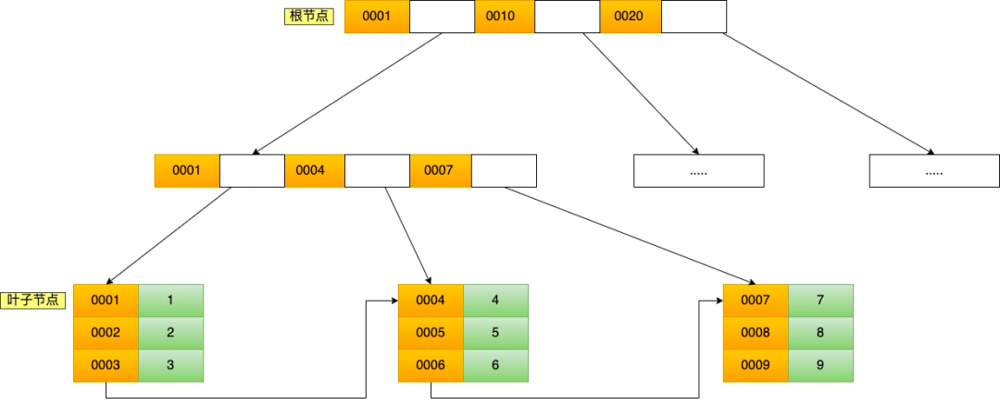
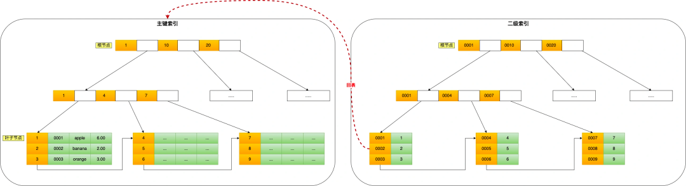
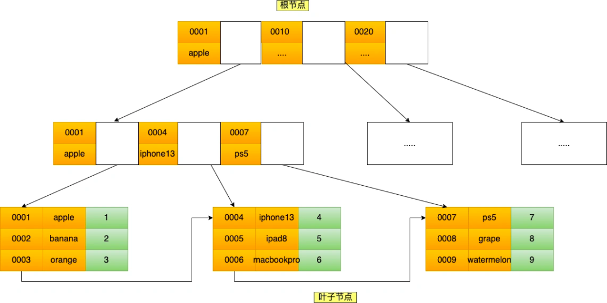

# 索引
## 索引的物理结构
索引底层数据结构存在很多种类型，常见的索引结构有: B 树， B+树 和 Hash、红黑树。在 MySQL 中，无论是 Innodb 还是 MyIsam，都使用了 B+树作为索引结构。
###

## 索引的物理结构-B+tree
B+tree是由二叉树->平衡二叉树->B-tree演化而来的

二叉树,平衡二叉树可以查看 [数据结构-算法-二叉树中定义]

平衡二叉树在插入后整个树依然是平衡的，它会通过左旋和右旋来使不平衡的树变为平衡树。


## 索引分类
### 按底层存储方式分
* 聚集索引

  索引结构和数据一起存放的索引，InnoDB 中的主键索引就属于聚簇索引。
* 非聚簇索引
  
  索引结构和数据分开存放的索引，二级索引(辅助索引)就属于非聚簇索引。MySQL 的 MyISAM 引擎，不管主键还是非主键，使用的都是非聚簇索引。

### 按应用维度划分
* 主键索引

  加速查询 + 列值唯一（不可以有 NULL）+ 表中只有一个。
* 唯一索引

  加速查询 + 列值唯一（可以有NULL）
* 普通索引

  仅加速查询。
* 覆盖索引
    
    一个索引包含（覆盖）所有需要查询的字段的值

* 联合索引

    多列值组成一个索引，专门用于组合搜索，其效率大于索引合并。
* 全文索引

    对文本的内进行分词，进行搜索。目前只对CHAR、VARCHAR、TEXT列上可以创建全文索引。一般不会使用，效率较低。通常使用搜索引擎ES代替。

## 聚簇索引与非聚簇索引
### 聚集索引
索引结构和数据放在一起。索引键值的逻辑顺序决定了表数据行的物理存储顺序。聚集索引叶子结点存放表中所有行数据记录的信息。数据即索引，索引即数据。

使用InnoDB引擎的表，主键索引就是聚集索引

在 MySQL 中，InnoDB 引擎的表的 .ibd文件就包含了该表的索引和数据，对于 InnoDB 引擎表来说，该表的索引(B+树)的每个非叶子节点存储索引，叶子节点存储索引和索引对应的数据。

#### 优点
* 查询速度非常快

    B+树本身就是一颗多叉平衡树，叶子结点是有序的，定位到索引结点就相当于定位到了数据。
* 对排序查找和范围查找优化

    主键对排序查找和范围查找速度非常快

#### 缺点
* 依赖有序对数据

    因为B+树是多路平衡树，如果索引的数据不是有序的，需要在插入时排序。类似字符串或者UUID这种又长又难比较的数据，插入或者查询速度比较慢
* 更新代价大
    
    索引列被修改的时候，索引就要被修改。

### 非聚集索引
索引结构和数据分开存放的索引

索引的叶子结点存放是主键，根据主键再回表查询主键索引的B+树

#### 优点
更新代价比聚集索引小。

#### 缺点
* 依赖于有序的数据
* 可能需要二次回表

  当查询到索引对应的指针或者主键后，需要根据指针或者主键回表查询。

### 为什么一直强调主键索引数据需要有序
主键是自增主键，那么所有的叶子结点就都是有序的，查询效率非常高。



### 非聚集索引查询一定需要回表吗？

不一定
```sql
SELECT name FROM table WHERE name='guang19';
```
name上建立了普通索引，查询的也是name，索引树上的key就是name，查到了直接返回

## 主键索引
数据表的主键列使用的就是主键索引

一张数据表只能有一个主键，并且主键不能为null，不能重复（唯一）

在MySql的InnoDB数据表中，没有主动创建主键索引时，InnoDB会将第一个唯一索引且不允许为null的字段设置为主键索引。如果没有，会自动创建一个6byte的自增主键



## 二级索引
二级索引（Secondary Index）又称为辅助索引，是因为二级索引的叶子节点存储的数据是主键。也就是说，通过二级索引，可以定位主键的位置。
### 唯一索引
唯一 + 数据可为NULL

一个表可以有多个唯一索引

### 普通索引
  加速查询数据

### 前缀索引
  前缀索引只适用于字符串类型的数据。前缀索引是对文本的前几个字符创建索引，相比普通索引建立的数据更小， 因为只取前几个字符。

### 全文索引
  对文本的内进行分词，进行搜索。目前只对CHAR、VARCHAR、TEXT列上可以创建全文索引。一般不会使用，效率较低。通常使用搜索引擎ES代替。



## 覆盖索引 & 联合索引
### 覆盖索引
如果一个索引包含（或者说覆盖）所有需要查询的字段的值，我们就称之为 覆盖索引。

覆盖索引就是把要查询出的列和索引是对应的，不做回表操作！

在score`,`name`上创建索引
```sql
SELECT `score`,`name` FROM `cus_order` ORDER BY `score` DESC;#降序排序
```

或者在name上创建索引
```sql
SELECT name FROM table WHERE name='guang19';
SELECT id FROM table WHERE name='guang19';
```

### 联合索引
使用表中的多个字段创建索引，就是 联合索引

联合索引的使用中必须满足最左前缀匹配原则

#### 最左前缀匹配原则

```text
最左前缀匹配原则指的是，在使用联合索引时，MySQL 会根据联合索引中的字段顺序，从左到右依次到查询条件中去匹配，如果查询条件中存在与联合索引中最左侧字段相匹配的字段，则就会使用该字段过滤一批数据，直至联合索引中全部字段匹配完成，或者在执行过程中遇到范围查询（如 >、<）才会停止匹配。
对于 >=、<=、BETWEEN、like 前缀匹配的范围查询，并不会停止匹配。所以，我们在使用联合索引时，可以将区分度高的字段放在最左边，这也可以过滤更多数据
```

建立索引 （a,b,c）
1. 等值查询

用到联合索引：
```text
      where a=1；
      where a=1 and b=2 and c=3；
      where a=1 and b=2；
      需要注意的是，因为有查询优化器，所以 a 字段在 where 子句的顺序并不重要。
```

没有用到索引
```text
      where b=2；
      where c=3；
      where b=2 and c=3；
      之所以会失效，是因为(a, b, c) 联合索引，是先按 a 排序，在 a 相同的情况再按 b 排序，在 b 相同的情况再按 c 排序。所以，b 和 c 是全局无序，局部相对有序的，这样在没有遵循最左匹配原则的情况下，是无法利用到索引的。
```

2. 范围查询

   在遇到范围查询（如 >、<）的时候，就会停止匹配，也就是范围查询的字段可以用到联合索引，但是在范围查询字段后面的字段无法用到联合索引。注意，对于 >=、<=、BETWEEN、like 前缀匹配的范围查询，并不会停止匹配。

## 举例子
理解了上面的各种例子，可以根据图看看自己是否懂了没有

链接地址：https://mp.weixin.qq.com/s/8qemhRg5MgXs1So5YCv0fQ



底层数据结构：


### 在主键索引树上查找数据
执行该语句
```sql
 select * from t_product where id = 5
```
因为 B+Tree 是一个有序的数据结构，所以可以通过二分查找算法快速定位到这条记录
```text
从根节点开始，将 5 与根节点的索引数据 (1，10，20) 比较，5 在 1 和 10 之间，根据二分查找算法，找到第二层的索引数据 (1，4，7)；

在第二层的索引数据 (1，4，7)中进行查找，因为 5 在 4 和 7 之间，根据二分查找算法，找到第三层的索引数据（4，5，6）；

在叶子节点的索引数据（4，5，6）中进行查找，然后我们找到了索引值为 5 的这条记录。
```

主键索引即聚集索引 叶子结点存放着数据，非聚集索引结点存放的是主键值

### 在非聚集索引上查找数据
product_no （商品编码）字段设置为二级索引


```sql
select * from product where product_no = '0002';
```
会先在二级索引的 B+Tree 中快速查找到 product_no 为 0002 的二级索引记录，然后获取主键值，然后利用主键值在主键索引的 B+Tree 中快速查询到对应的叶子节点，然后获取完整的记录。这个过程叫「回表」，也就是说要查两个 B+Tree 才能查到数据


### 在联合索引树上查找数据
表中的 product_no 和 name 字段组合成联合索引`(product_no, name)`


联合索引的非叶子节点用两个字段的值作为 B+Tree 的索引值。

联合索引的 B+Tree 是先按 product_no 进行排序，然后再 product_no 相同的情况再按 name 字段排序。

## 索引下推
当MySQL使用索引扫描进行查询时，如果查询条件可以直接应用于索引，MySQL就会将这些条件下推到索引层级，只读取符合条件的记录，从而减少了磁盘IO和CPU资源的消耗。这样就可以大幅缩短查询时间，并减少系统的负载。

索引下推需要MySQL版本在5.6及以上

## 分析语句是否走索引查询


## 正确使用索引
### 1. 选择合适的字段创建索引
* 尽量不为 NULL 的字段

  索引字段的数据应该尽量不为 NULL，因为对于数据为 NULL 的字段，数据库较难优化。如果字段频繁被查询，但又避免不了为 NULL，建议使用 0,1,true,false 这样语义较为清晰的短值或短字符作为替代。

* 被频繁查询的字段
* 被作为条件查询的字段
* 频繁需要排序的字段

  索引已经排序，这样查询可以利用索引的排序，加快排序查询时间。

* 被经常频繁用于连接的字段

  提高多表连接查询的效率。

### 2. 被频繁更新的字段应该慎重建立索引

### 3. 限制每张表上的索引数量
建议单张表索引不超过 5 个！

如果同时有很多个索引都可以用于查询，就会增加 MySQL 优化器生成执行计划的时间，同样会降低查询性能。

### 4. 尽可能的考虑建立联合索引而不是单列索引
```text
因为索引是需要占用磁盘空间的，可以简单理解为每个索引都对应着一颗 B+树。
如果一个表的字段过多，索引过多，那么当这个表的数据达到一个体量后，索引占用的空间也是很多的，且修改索引时，耗费的时间也是较多的。
如果是联合索引，多个字段在一个索引上，那么将会节约很大磁盘空间，且修改数据的操作效率也会提升。
```

### 5. 避免索引失效
* 使用 SELECT * 进行查询; 
```text
SELECT * 不会直接导致索引失效（如果不走索引大概率是因为 where 查询范围过大导致的），但它可能会带来一些其他的性能问题比如造成网络传输和数据处理的浪费、无法使用索引覆盖;
```

* 创建了组合索引，但查询条件未遵守最左匹配原则;

* 在索引列上进行计算、函数、类型转换等操作;

* 以 % 开头的 LIKE 查询比如 like '%abc';


## 创建索引语句
### 创建普通索引
```sql
CREATE INDEX index_name ON table_name (column_name);
```

### 创建唯一索引
```sql
CREATE UNIQUE INDEX index_name ON table_name (column_name);
```

### 创建全文索引
```sql
CREATE FULLTEXT INDEX index_name ON table_name (column_name);
```

### 创建联合索引
```sql
CREATE INDEX index_name ON table_name (column1, column2, ...);
```

### 创建主键索引
```sql
CREATE TABLE students (
    id INT PRIMARY KEY,
    name VARCHAR(50),
    age INT
);
```