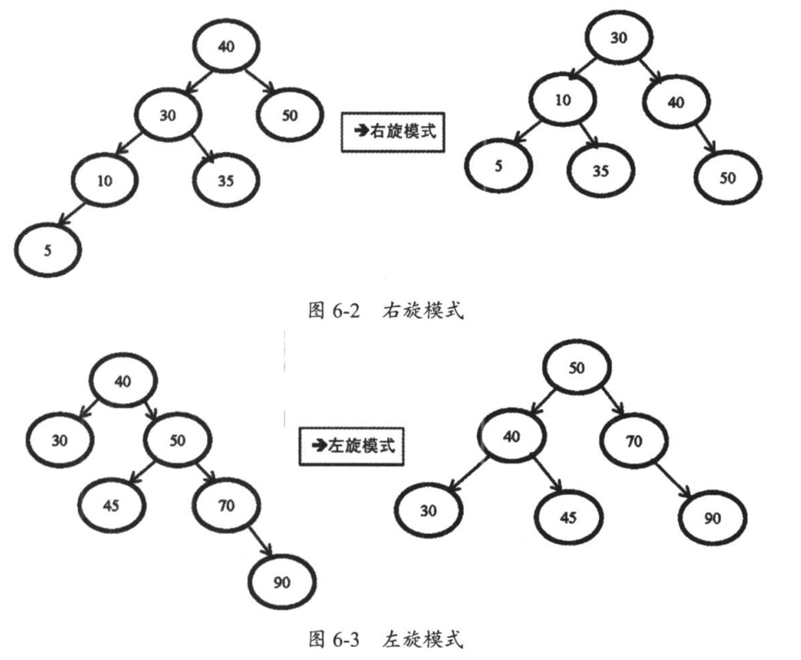

## 索引
### 索引的物理结构-B+tree
B+tree是由二叉树->平衡二叉树->B-tree演化而来的

二叉树,平衡二叉树可以查看 [数据结构-算法-二叉树中定义]

平衡二叉树在插入后整个树依然是平衡的，它会通过左旋和右旋来使不平衡的树变为平衡树。



### 索引分类
#### 按底层存储方式分
* 聚集索引

  索引结构和数据一起存放的索引，InnoDB 中的主键索引就属于聚簇索引。
* 非聚簇索引（普通索引）
  
  索引结构和数据分开存放的索引，二级索引(辅助索引)就属于非聚簇索引。MySQL 的 MyISAM 引擎，不管主键还是非主键，使用的都是非聚簇索引。

#### 按应用维度划分
* 主键索引

  加速查询 + 列值唯一（不可以有 NULL）+ 表中只有一个。
* 唯一索引

  加速查询 + 列值唯一（可以有NULL）
* 普通索引

  仅加速查询。
* 覆盖索引
    
    一个索引包含（覆盖）所有需要查询的字段的值

* 联合索引

    多列值组成一个索引，专门用于组合搜索，其效率大于索引合并。
* 全文索引

    对文本的内进行分词，进行搜索。目前只对CHAR、VARCHAR、TEXT列上可以创建全文索引。一般不会使用，效率较低。通常使用搜索引擎ES代替。

### 聚簇索引与非聚簇索引
#### 聚集索引
索引结构和数据放在一起。索引键值的逻辑顺序决定了表数据行的物理存储顺序。聚集索引叶子结点存放表中所有行数据记录的信息。数据即索引，索引即数据。

使用InnoDB引擎的表，主键索引就是聚集索引

在 MySQL 中，InnoDB 引擎的表的 .ibd文件就包含了该表的索引和数据，对于 InnoDB 引擎表来说，该表的索引(B+树)的每个非叶子节点存储索引，叶子节点存储索引和索引对应的数据。

##### 优点
* 查询速度非常快

    B+树本身就是一颗多叉平衡树，叶子结点是有序的，定位到索引结点就相当于定位到了数据。
* 对排序查找和范围查找优化

    主键对排序查找和范围查找速度非常快

##### 缺点
* 依赖有序对数据

    因为B+树是多路平衡树，如果索引的数据不是有序的，需要在插入时排序。类似字符串或者UUID这种又长又难比较的数据，插入或者查询速度比较慢
* 更新代价大
    
    索引列被修改的时候，索引就要被修改。

#### 非聚集索引
索引结构和数据分开存放的索引

索引的叶子结点存放是主键，根据主键再回表查询主键索引的B+树


### 主键索引
数据表的主键列使用的就是主键索引

一张数据表只能有一个主键，并且主键不能为null，不能重复（唯一）

在MySql的InnoDB数据表中，没有主动创建主键索引时，InnoDB会将第一个唯一索引且不允许为null的字段设置为主键索引。如果没有，会自动创建一个6byte的自增主键

## 创建索引语句
```text

```