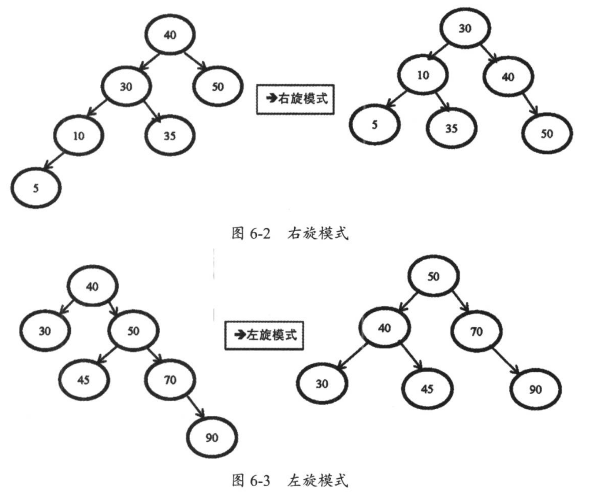

## Mysql主流版本和分支
* Oracle官方的MySQL
* Percona Server
* MaraDB

## 安装MySql
网上的教程很多，随便搜索
### 自用Docker安装
#### Linux下安装5.7
```shell
# my.cnf 指定配置文件
# /var/lib/mysql 指定数据目录
docker run -p 13306:3306 --name mysql-dev -e MYSQL_ROOT_PASSWORD=qwer123456 --restart=always -v /opt/mysql/my.cnf:/etc/mysql/my.cnf -v /opt/mysql/data:/var/lib/mysql -d mysql:5.7.25
```
#### Linux使用8.0镜像
```shell
mysql/mysql-server:8.0
```
#### M1芯片安装
##### 5.7 镜像
```shell
ibex/debian-mysql-server-5.7:5.7.22
biarms/mysql:5.7.33-beta-circleci
```
##### 8.0镜像
```text
ubuntu/mysql:8.0-22.04_beta
```

### 远程登陆授权
#### 5.7远程登陆
```shell
#进入mysql容器
docker exec -it my-mysql-5.7 bash
#进入mysql
mysql -uroot -p123456
#授权远程登陆
grant all privileges on *.* to 'root'@'%' identified by '123456' with grant option;
flush privileges;
quit;
```
#### 8.0授权
```shell
ALTER USER 'root'@'%' IDENTIFIED BY '123';
ALTER USER 'root'@'%' IDENTIFIED WITH mysql_native_password BY '123';
FLUSH PRIVILEGES;
```

### 通过TCP/IP网络连接
```shell
mysql -u username -p password -P port -h IP
```

## MySql体系结构
MySql的体系结构分为两层：
* MySql Server层 
  * 连接层
  * SQL层
* 存储引擎层


MySql Server层包括 连接器、查询缓存、分析器、优化器、执行器等
### Query Cache
查询缓存在生产中建议关闭，因为它只能缓存静态数据信息。数据经常读写就会变的很鸡肋。5.6版本前是默认开启的，5.6后是默认关闭的。

### 存储引擎
MySql主要使用的两个存储引擎是：MyISAM和InnoDB


### InnoDB系统结构


## 数据库文件
### MySQL读取配置文件的顺序
MySql读取配置文件的顺序依次是：
* /etc/my.cnf 全局配置文件
* /etc/mysql/conf.d/*.cnf MySQL 会读取 /etc/mysql/conf.d/ 目录下所有以 .cnf 结尾的配置文件。你可以将自定义的配置文件放在这个目录中，并按照字母顺序进行读取。
* /etc/mysql/mysql.conf.d/*.cnf  MySQL 进一步读取 /etc/mysql/mysql.conf.d/ 目录下所有以 .cnf 结尾的配置文件。这个目录也可用于添加额外的配置文件，MySQL 会按照字母顺序读取这些文件。

### 参数类型
MySql数据库将参数分为两类：一类是动态参数，一类是静态参数
#### 动态参数
MySql在运行中可以对参数在线修改，可以通过 set global和 set session 两个命令。
```text
global代表全局参数，修改完后，推出当前会话仍然有效，但如果重启数据库，设置的参数就会失效。
```
```text
session只是针对当前会话有效，一旦退出，设置的参数回立即失效。
```
#### 静态参数
无法在线修改的参数，需要在配置文件中修改，然后启动数据库才生效

### 错误日志文件（error log）
记录MySql在启动、运行、关闭中出现的问题  

查询error_log文件位置：
```text
mysql> show variables like 'log_error'
+---------------+--------+
| Variable_name | Value  |
+---------------+--------+
| log_error     | stderr |
+---------------+--------+
```
```text
Linux 系统：在 /var/log/mysql/error.log 或 /var/log/mysqld.err 文件中。
macOS 系统：在 /usr/local/var/mysql/hostname.err 文件中，其中 hostname 是你的主机名。
Windows 系统：在 MySQL 安装目录下的 data 文件夹中的 .err 文件，例如 C:\ProgramData\MySQL\MySQL Server 8.0\Data\hostname.err。
```

### 二进制日志文件（binary log）
binlog
/ˈbaɪnəri/

#### 开启binlog
* 在配置文件中
```text
log_bin = ON
```
mysql5.7是默认关闭，mysql8.0是默认开启的

#### 查看binlog相关配置和存放地址的命令
##### 作用
* 完成主从复制。主服务器上修改话剧的操作都会记录到binlog中
* 进行恢复操作。数据可以通过binlog日志，使用mysqlbinlog命令，基于某个时间和位置去恢复。

##### 使用命令查到binlog的相关配置以及文件存放的地址：
```text
mysql> show variables like '%log_bin%';
+---------------------------------+-----------------------------+
| Variable_name                   | Value                       |
+---------------------------------+-----------------------------+
| log_bin                         | ON                          |
| log_bin_basename                | /var/lib/mysql/binlog       |
| log_bin_index                   | /var/lib/mysql/binlog.index |
| log_bin_trust_function_creators | OFF                         |
| log_bin_use_v1_row_events       | OFF                         |
| sql_log_bin                     | ON                          |
+---------------------------------+-----------------------------+
```
* 到对应目录中查看
```text
bash-4.4# ls | grep bin
binlog.000001
binlog.000002
binlog.index
```
binlog.000001和binlog.000002 是binlog文件，binlog.index 是binlog的索引文件，用来记录产生的二进制日志的序号
```text
bash-4.4# cat binlog.index 
./binlog.000001
./binlog.000002
```
* 在命令行查看binlog文件
```text
show binary logs;
```
```text
+---------------+-----------+-----------+
| Log_name      | File_size | Encrypted |
+---------------+-----------+-----------+
| binlog.000001 |   3039831 | No        |
| binlog.000002 |       157 | No        |
+---------------+-----------+-----------+m
```
* 在命令行查看MySql当前的日志和状态
```text
show master status;
```
```text
mysql> show master status;
+---------------+----------+--------------+------------------+-------------------+
| File          | Position | Binlog_Do_DB | Binlog_Ignore_DB | Executed_Gtid_Set |
+---------------+----------+--------------+------------------+-------------------+
| binlog.000002 |      157 |              |                  |                   |
+---------------+----------+--------------+------------------+-------------------+
```
当前使用的binlog文件是binlog.000002，文件偏移量是157个字节


#### 如何看binlog日志
MySQL 的 binlog（二进制日志）有三种格式：statement、row 和 mixed。

Statement 格式：MySQL 将每个执行的 SQL 语句记录到 binlog 中。

Row 格式：MySQL 将每个修改前后的行数据都记录到 binlog 中。

Mixed 格式：Statement 格式和 Row 格式的混合使用。

##### 使用mysqlbinlog命令
```text
/usr/local/mysql/bin/mysqlbinlog -v --base64-output=decode-rows binlog.000001 > bin.log
```
--base64-output：将二进制文件输出格式为 Base64 编码。  
-v 代表可以看到具体的执行信息

eg: 新建一个表,使用命令查看binlog文件
```text
mysqlbinlog -v --base64-output=decode-rows binlog.000002 > bintest2.log
```
```text
SET TIMESTAMP=1692178051/*!*/;
/*!80013 SET @@session.sql_require_primary_key=0*//*!*/;
CREATE TABLE students (
  id INT AUTO_INCREMENT,
  name VARCHAR(50) NOT NULL,
  age INT,
  CONSTRAINT pk_students PRIMARY KEY (id)
) ENGINE=InnoDB
/*!*/;
# at 1239
#230816  9:30:50 server id 1  end_log_pos 1318 CRC32 0xcce4a335 	Anonymous_GTID	last_committed=4	sequence_number=5	rbr_only=yes	original_committed_timestamp=1692178250870308	immediate_commit_timestamp=1692178250870308	transaction_length=297
/*!50718 SET TRANSACTION ISOLATION LEVEL READ COMMITTED*//*!*/;
```

eg: 插入一条数据,使用命令查看binlog文件
```text
mysql> insert into students (name,age) values('dick', 17);
Query OK, 1 row affected (0.01 sec)

mysql> select * from students
    -> ;
+----+------+------+
| id | name | age  |
+----+------+------+
|  1 | dick |   17 |
+----+------+------+
```
```text
BEGIN
/*!*/;
# at 1393
#230816  9:30:50 server id 1  end_log_pos 1456 CRC32 0x35771552 	Table_map: `test`.`students` mapped to number 92
# has_generated_invisible_primary_key=0
# at 1456
#230816  9:30:50 server id 1  end_log_pos 1505 CRC32 0x97edcece 	Write_rows: table id 92 flags: STMT_END_F
### INSERT INTO `test`.`students`
### SET
###   @1=1
###   @2='dick'
###   @3=17
# at 1505
#230816  9:30:50 server id 1  end_log_pos 1536 CRC32 0x2660ded4 	Xid = 29
COMMIT/*!*/;
```

eg: 更新一条数据,使用命令查看binlog文件
```text
mysql> update students set age = 25 where id = 1;
Query OK, 1 row affected (0.01 sec)
Rows matched: 1  Changed: 1  Warnings: 0

mysql> select * from students;
+----+------+------+
| id | name | age  |
+----+------+------+
|  1 | dick |   25 |
+----+------+------+
```
```text
BEGIN
/*!*/;
# at 1699
#230816  9:36:26 server id 1  end_log_pos 1762 CRC32 0x3b636dcd 	Table_map: `test`.`students` mapped to number 92
# has_generated_invisible_primary_key=0
# at 1762
#230816  9:36:26 server id 1  end_log_pos 1826 CRC32 0x06550163 	Update_rows: table id 92 flags: STMT_END_F
### UPDATE `test`.`students`
### WHERE
###   @1=1
###   @2='dick'
###   @3=17
### SET
###   @1=1
###   @2='dick'
###   @3=25
# at 1826
#230816  9:36:26 server id 1  end_log_pos 1857 CRC32 0x8a6e101a 	Xid = 31
COMMIT/*!*/;
SET @@SESSION.GTID_NEXT= 'AUTOMATIC' /* added by mysqlbinlog */ /*!*/;
DELIMITER ;
# End of log file
```

通过三个例子可以看到 在 Row 格式下，MySQL 将每个修改前后的行数据都记录到 binlog 中。

#### 涉及binlog的相关参数
##### max_binlog_size
````text
mysql> show variables like 'max_binlog_size';
+-----------------+------------+
| Variable_name   | Value      |
+-----------------+------------+
| max_binlog_size | 1073741824 |
+-----------------+------------+
````
该参数制定了点那个binlog的最大值。如果超过该值就会自动生产新的binlog文件，重启MySql实例也会生成新的binlog。默认值是1GB  

生产环境一般控制binlog的生产时间最小间隔保持在2～5分钟，参数不要太大，可以设置为256MB
##### binlog_cache_size
```text
mysql> show variables like 'binlog_cache_size';
+-------------------+-------+
| Variable_name     | Value |
+-------------------+-------+
| binlog_cache_size | 32768 |
+-------------------+-------+
```
所有未提交的事务会记录到一个缓存中，等待事务提交时，直接将缓存中的二进制日志写入到binlog中。  
该缓存由binlog_cache_size决定，默认是32KB。    
基于会话，一个线程开始一个事务，MySql就会自动分配一个该值大小的缓存。  
该值太小，就会使用磁盘上临时文件来记录。
```text
mysql> show global status like '%binlog_cache%';
+-----------------------+-------+
| Variable_name         | Value |
+-----------------------+-------+
| Binlog_cache_disk_use | 0     |
| Binlog_cache_use      | 0     |
+-----------------------+-------+
```
使用show global status like '%binlog_cache%' 查出Binlog_cache_disk_use=0 说明没有使用磁盘文件

##### expire_logs_days
binlog过期时间，单位是天
```text
mysql> show variables like '%expire_logs_days%';
+------------------+-------+
| Variable_name    | Value |
+------------------+-------+
| expire_logs_days | 0     |
+------------------+-------+
```

### 慢查询日志（slow log）
```text
mysql> show variables like '%slow%';
+-----------------------------+--------------------------------------+
| Variable_name               | Value                                |
+-----------------------------+--------------------------------------+
| log_slow_admin_statements   | OFF                                  |
| log_slow_extra              | OFF                                  |
| log_slow_replica_statements | OFF                                  |
| log_slow_slave_statements   | OFF                                  |
| slow_launch_time            | 2                                    |
| slow_query_log              | OFF                                  |
| slow_query_log_file         | /var/lib/mysql/306c86313d43-slow.log |
+-----------------------------+--------------------------------------+
```
### 全量日志（general log）
general log会记录MySql数据库所有操作的SQL语句，包含select和show，一般情况下不会被开启

### 中继日志（relay log）


### 表结构文件


### InnoDB存储引擎文件
InnoDB存储引擎层面主要有两种日志，一种是redo日志，一种是undo日志。    

InnoDB支持事务，支持MVCC多版本并发控制。InnoDB的多版本是通过undo和回滚段实现的  

InnoDB是索引组织表，每行记录都实现了三个隐藏字段：DB_ROW_ID、DB_TRX_ID、DB_ROLL_PTR

DB_ROW_ID：表示每个数据行的物理位置
DB_TRX_ID：是一个事务ID，用于标识修改数据行的事务
DB_ROLL_PTR：是一个指向回滚段中回滚记录的指针，用于支持事务的回滚和恢复功能

redo log 用于记录事务操作变化，记录的是数据被修改之后的值。

undo log对记录做变更操作时不仅会产生redo记录，也会产生undo记录（insert、update、delete）但是undo只记录变更前的旧数据。undo默认记录在系统表空间（ibdata1），MySql5.6后也可以使用独立的undo表空间。


## 索引
### B+tree
B+tree是由二叉树->平衡二叉树->B-tree演化而来的

二叉树,平衡二叉树可以查看 [数据结构-算法-二叉树中定义]  

平衡二叉树在插入后整个树依然是平衡的，它会通过左旋和右旋来使不平衡的树变为平衡树。




## 事务
### 事务的特性
1. 原子性
一个事务中所有操作要么都做，要么都不做
2. 一致性
一致性是指数据库中的数据在事务操作前和事务处理后必须满足业务规则约束
eg：甲乙账户的总金额在转账前和转账后必须一致，如有不一致，则必须是短暂的，且只有在事务提交前才会出现。
3. 隔离性
隔离是指数据库允许多个并发事务同时对数据进行读写和修改的能力，隔离性可以防止多个事务并发执行时由于交叉执行导致数据不一致。
4. 持久性
事务处理结束后，对数据的修改是永久性，即使发生故障也不会丢失。
### 事务语句
事务开启语句是由begin，事务结束是以commit或者rollback显示结束
```text
begin;
DML语句
commit/rollback
```
MySql数据库可以使用autocommit=1开启自动提交，关闭手动提交。

Oracle数据库中事务不是自动提交的，而MySql为什么要关闭自动提交？
1. 不用一个事务一次提交了，提高了每秒处理事务的能力。
2. 如果过程中某个事务一直没有提交，就会导致行锁等待的现象，就会严重影响数据库的TPS值。

### truncate和delete的区别
truncate是DDL语句操作，delete是DML语句操作。
* truncate不能回滚，delete可以回滚

* truncate可以清空表的自增id属性，从1开始重新记录，而delete不会。

### 事务隔离级别
MySql InnoDB存储引擎实现SQL标准的4种隔离级别。
低级别的隔离级一般支持更高的并发处理，并拥有更低的系统开销。MySql数据库通过 SHOW VARIABLES LIKE 'transaction_isolation'; 来查看当前数据库的隔离级别
```text
+-----------------------+-----------------+
| Variable_name         | Value           |
+-----------------------+-----------------+
| transaction_isolation | REPEATABLE-READ |
+-----------------------+-----------------+
```
MySql默认的隔离级别是 REPEATABLE-READ
#### 读未提交（read uncommitted）
在其中一个事务中，可以读取到其他事务未提交的数据变化。读取到其他还没有提交的事务叫做脏读。
#### 读已提交（read committed）
在其中一个事务中，可以读取到其他事务已经提交的数据变化。这种读取叫做不可重复读，允许幻读现象的发生，是Oracle数据库默认的事务隔离级别。
#### 可重复读（repeatable read）
在其中一个事务中，直到事务结束前，都可以读取到事务刚开始看到的数据，并一直不会发生变化，避免了脏读、不可重复读、幻读的发生
#### 串行
在每个读的数据行上都需要加表级共享锁，在每次写数据时都要加表级排他锁，并发能力严重下降


## MySql库表常用命令
### 选择你所创建的数据库
```text
use database; 
```

### 查看所有数据库
```text
show databases\
```

### 查看某库下所有的表
```text
show tables
```

### 创建数据库
```text
create database database name
```

### 删除数据库
```text
drop database database name
```

### 创建表
```text
create table table name(字段列表)
```

### 删除表(表结构也被删除)
```text
drop table table name
```

### 只删除表数据
```text
delete from table name(where)或者truncatetable table name
```

### 往表中插入数据
```text
insert into table name(字段列表)values(对应字段的值)
```

### 更新表中某行数据
```text
update table_name set:字段名=某值(where)
```

### 查看建表语句
```text
show create table table name\G:
```

### 查看表结构
```text
desc table name
```

### 获取表基础信息
```text
show table status
```

### 查看当前表下索引的情况
```text
show index from table name
```

### 查看数据库当前连接的情况
```text
show full processlist
```

## DML和DDL
```text
DML（Data Manipulation Language）：数据操作语言，用于对数据库中的数据进行操作，包括插入、更新、删除和查询等操作。常见的DML语句有：
INSERT：用于向表中插入新的数据行。
UPDATE：用于修改表中已有的数据行。
DELETE：用于删除表中的数据行。
SELECT：用于从表中查询数据行。
DML语句主要用于操作和处理数据库中的实际数据。

DDL（Data Definition Language）：数据定义语言，用于定义和管理数据库对象的结构和属性。DDL语句通常用于创建、修改和删除数据库对象（如表、视图、索引等），以及定义约束条件。常见的DDL语句有：
CREATE：用于创建数据库对象，如创建表、视图、索引等。
ALTER：用于修改数据库对象的结构，如修改表结构、添加列等。
DROP：用于删除数据库对象，如删除表、视图等。
TRUNCATE：用于删除表中的所有数据行。
DDL语句主要用于定义数据库的结构和组织方式。
```