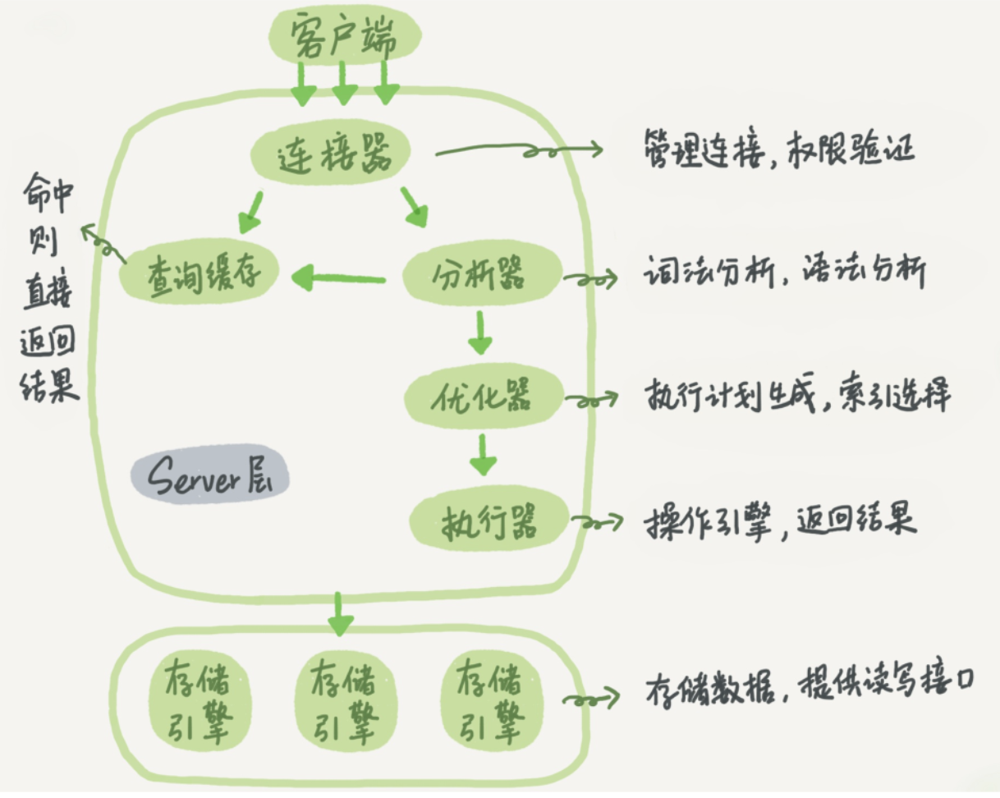
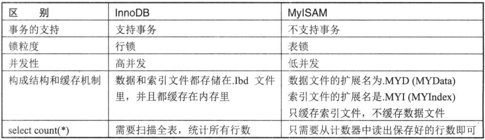

主要对《MySql王者晋级之路》和 《JavaGuide》MySql模块的学习总结和自己的理解

## Mysql主流版本和分支
* Oracle官方的MySQL
* Percona Server
* MaraDB

## 安装MySql
网上的教程很多，随便搜索
### 自用Docker安装
#### Linux下安装5.7
```shell
# my.cnf 指定配置文件
# /var/lib/mysql 指定数据目录
docker run -p 13306:3306 --name mysql-dev -e MYSQL_ROOT_PASSWORD=qwer123456 --restart=always -v /opt/mysql/my.cnf:/etc/mysql/my.cnf -v /opt/mysql/data:/var/lib/mysql -d mysql:5.7.25
```
#### Linux使用8.0镜像
```shell
mysql/mysql-server:8.0
```
#### M1芯片安装
##### 5.7 镜像
```shell
ibex/debian-mysql-server-5.7:5.7.22
biarms/mysql:5.7.33-beta-circleci
```
##### 8.0镜像
```text
ubuntu/mysql:8.0-22.04_beta
```

### 远程登陆授权
#### 5.7远程登陆
```shell
#进入mysql容器
docker exec -it my-mysql-5.7 bash
#进入mysql
mysql -uroot -p123456
#授权远程登陆
grant all privileges on *.* to 'root'@'%' identified by '123456' with grant option;
flush privileges;
quit;
```
#### 8.0授权
```shell
ALTER USER 'root'@'%' IDENTIFIED BY '123';
ALTER USER 'root'@'%' IDENTIFIED WITH mysql_native_password BY '123';
FLUSH PRIVILEGES;
```

### 通过TCP/IP网络连接
```shell
mysql -u username -p password -P port -h IP
```

## MySql体系结构
MySql的体系结构分为两层：
* MySql Server层 
  * 连接层
  * SQL层
* 存储引擎层



MySql Server层包括 连接器、查询缓存、分析器、优化器、执行器等
### Query Cache
查询缓存在生产中建议关闭，因为它只能缓存静态数据信息。数据经常读写就会变的很鸡肋。5.6版本前是默认开启的，5.6后是默认关闭的。

### 存储引擎
MySql主要使用的两个存储引擎是：MyISAM和InnoDB


### InnoDB系统结构


## 数据库文件
### MySQL读取配置文件的顺序
MySql读取配置文件的顺序依次是：
* /etc/my.cnf 全局配置文件
* /etc/mysql/conf.d/*.cnf MySQL 会读取 /etc/mysql/conf.d/ 目录下所有以 .cnf 结尾的配置文件。你可以将自定义的配置文件放在这个目录中，并按照字母顺序进行读取。
* /etc/mysql/mysql.conf.d/*.cnf  MySQL 进一步读取 /etc/mysql/mysql.conf.d/ 目录下所有以 .cnf 结尾的配置文件。这个目录也可用于添加额外的配置文件，MySQL 会按照字母顺序读取这些文件。

### 参数类型
MySql数据库将参数分为两类：一类是动态参数，一类是静态参数
#### 动态参数
MySql在运行中可以对参数在线修改，可以通过 set global和 set session 两个命令。
```text
global代表全局参数，修改完后，推出当前会话仍然有效，但如果重启数据库，设置的参数就会失效。
```
```text
session只是针对当前会话有效，一旦退出，设置的参数回立即失效。
```
#### 静态参数
无法在线修改的参数，需要在配置文件中修改，然后启动数据库才生效

### 错误日志文件（error log）
记录MySql在启动、运行、关闭中出现的问题  

查询error_log文件位置：
```text
mysql> show variables like 'log_error'
+---------------+--------+
| Variable_name | Value  |
+---------------+--------+
| log_error     | stderr |
+---------------+--------+
```
```text
Linux 系统：在 /var/log/mysql/error.log 或 /var/log/mysqld.err 文件中。
macOS 系统：在 /usr/local/var/mysql/hostname.err 文件中，其中 hostname 是你的主机名。
Windows 系统：在 MySQL 安装目录下的 data 文件夹中的 .err 文件，例如 C:\ProgramData\MySQL\MySQL Server 8.0\Data\hostname.err。
```

### InnoDB存储引擎文件
InnoDB存储引擎层面主要有两种日志，一种是redo日志，一种是undo日志。    

InnoDB支持事务，支持MVCC多版本并发控制。InnoDB的多版本是通过undo和回滚段实现的  

InnoDB是索引组织表，每行记录都实现了三个隐藏字段：DB_ROW_ID、DB_TRX_ID、DB_ROLL_PTR

DB_ROW_ID：表示每个数据行的物理位置
DB_TRX_ID：是一个事务ID，用于标识修改数据行的事务
DB_ROLL_PTR：是一个指向回滚段中回滚记录的指针，用于支持事务的回滚和恢复功能

redo log 用于记录事务操作变化，记录的是数据被修改之后的值。

undo log对记录做变更操作时不仅会产生redo记录，也会产生undo记录（insert、update、delete）但是undo只记录变更前的旧数据。undo默认记录在系统表空间（ibdata1），MySql5.6后也可以使用独立的undo表空间。

## MySql库表常用命令
### 选择你所创建的数据库
```text
use database; 
```

### 查看所有数据库
```text
show databases\
```

### 查看某库下所有的表
```text
show tables
```

### 创建数据库
```text
create database database name
```

### 删除数据库
```text
drop database database name
```

### 创建表
```text
create table table name(字段列表)
```

### 删除表(表结构也被删除)
```text
drop table table name
```

### 只删除表数据
```text
delete from table name(where)或者truncatetable table name
```

### 往表中插入数据
```text
insert into table name(字段列表)values(对应字段的值)
```
```text
INSERT INTO students
VALUES (0, 'a', 0),
       (5, 'b', 5),
       (10, 'c', 10);
```
```text
insert into students (id,name,age) values
(0, 'a', 0),
(5, 'b', 5)
(25, 'f', 25);
```
### 更新表中某行数据
```text
update table_name set:字段名=某值(where)
```

### 查看建表语句
```text
show create table table name\G:
```

### 查看表结构
```text
desc table name
```

### 获取表基础信息
```text
show table status
```
```text
SHOW TABLE STATUS LIKE '表名' \G
```

### 查看当前表下索引的情况
```text
show index from table name
```

### 查看数据库当前连接的情况
```text
show full processlist
```

## DML和DDL
```text
DML（Data Manipulation Language）：数据操作语言，用于对数据库中的数据进行操作，包括插入、更新、删除和查询等操作。常见的DML语句有：
INSERT：用于向表中插入新的数据行。
UPDATE：用于修改表中已有的数据行。
DELETE：用于删除表中的数据行。
SELECT：用于从表中查询数据行。
DML语句主要用于操作和处理数据库中的实际数据。

DDL（Data Definition Language）：数据定义语言，用于定义和管理数据库对象的结构和属性。DDL语句通常用于创建、修改和删除数据库对象（如表、视图、索引等），以及定义约束条件。常见的DDL语句有：
CREATE：用于创建数据库对象，如创建表、视图、索引等。
ALTER：用于修改数据库对象的结构，如修改表结构、添加列等。
DROP：用于删除数据库对象，如删除表、视图等。
TRUNCATE：用于删除表中的所有数据行。
DDL语句主要用于定义数据库的结构和组织方式。
```


## 实际sql执行的分析

## 数据库设计

## MySql架构实际

## 其他

### MySql时间存储建议
#### Datetime 和 Timestamp
1. 时区区别

* DateTime 类型是没有时区信息的（时区无关），保存的时间都是当前会话所设置的时区对应的时间。 当你的时区更换之后，比如你的服务器更换地址或者更换客户端连接时区设置的话，就会导致你从数据库中读出的时间错误。

* Timestamp 和时区有关。Timestamp 类型字段的值会随着服务器时区的变化而变化，自动换算成相应的时间。

2. 占用空间

MySQL 5.6.4 之前，DateTime是8字节，Timestamp是4字节。

MySQL 5.6.4 开始，存储空间会根据毫秒精度的不同而变化，DateTime 的范围是 5~8 字节，Timestamp 的范围是 4~7 字节。

3. 表示的范围

Timestamp 表示的时间范围更小，只能到 2038 年

DateTime：1000-01-01 00:00:00.000000 ~ 9999-12-31 23:59:59.499999

Timestamp：1970-01-01 00:00:01.000000 ~ 2038-01-19 03:14:07.499999

#### 如何选择？

| 类型         | 存储空间   | 日期格式                               | 日期范围                                      | 是否带时区信息 |
|--------------|------------|---------------------------------------|----------------------------------------------|----------------|
| DATETIME     | 5~8字节    | YYYY-MM-DD hh:mm:ss[.fraction]         | 1000-01-01 00:00:00[.000000]-9999-12-31 23:59:59[.999999] | 否             |
| TIMESTAMP    | 4~7字节    | YYYY-MM-DD hh:mm:ss[.fraction]         | 1970-01-01 00:00:01[.000000]-2038-01-19 03:14:07[.999999] | 是             |
| 数值型时间戳 | 4字节      | 全数字                                | 1970-01-01 00:00:01之后的时间                 | 否             |

### MySQL执行计划分析
MySQL 为我们提供了 EXPLAIN 命令，来获取执行计划的相关信息。
```text
EXPLAIN + SELECT 查询语句；
```


