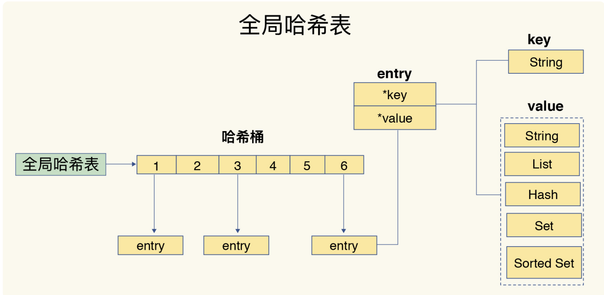
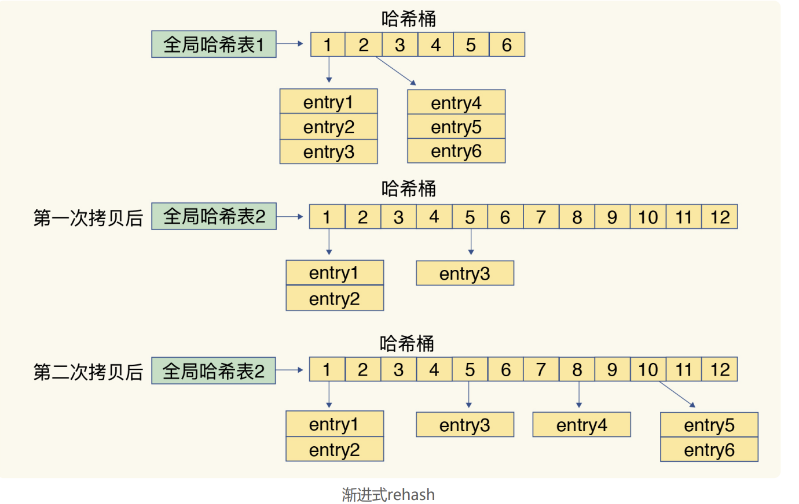
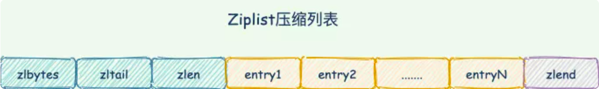
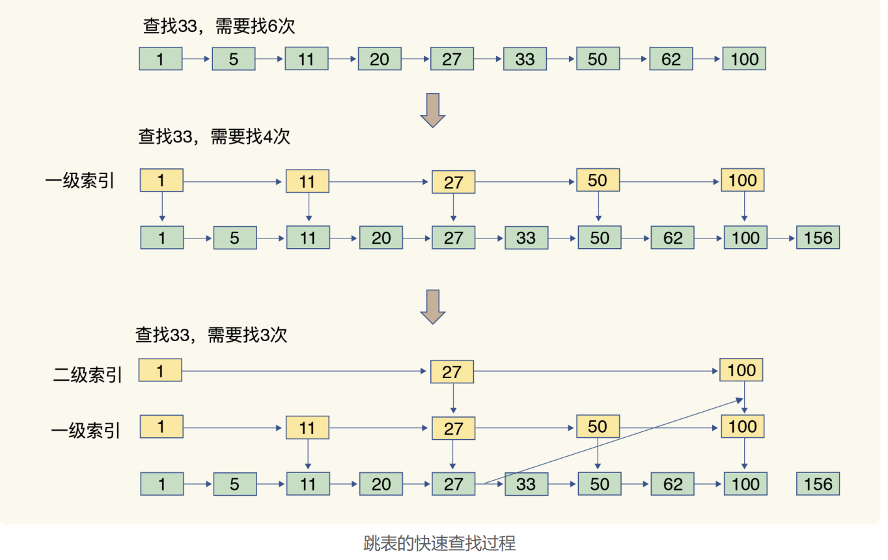

# Redis
## 使用docker搭建
M1芯片
```shell
docker run -p 16379:6379 --name redis-home -d arm64v8/redis:7.2-alpine
```

Linux

````shell
docker run -p 16379:6379 --name redis-home -d redis:6.2.3
````

访问本地redis

```shell
docker exec -it redis-home redis-cli
```

## 基本数据结构
### 全局哈希表 & 渐进式rehash
Redis 使用了一个哈希表来保存所有键值对。哈希桶中的元素保存的并不是值本身，而是指向具体值的指针。哈希桶中的 entry 元素中保存了*key和*value指针，分别指向了实际的键和值。



哈希表的最大好处，就是让我们可以用 O(1) 的时间复杂度来快速查找到键值对

为了高效和redis rehash不停顿，redis采用了渐进式rehash
```text
Redis 默认使用了两个全局哈希表：哈希表 1 和哈希表 2。一开始，当你刚插入数据时，默认使用哈希表 1，此时的哈希表 2 并没有被分配空间。

随着数据逐步增多，Redis 开始执行 rehash，这个过程分为三步：

1. 给哈希表 2 分配更大的空间，例如是当前哈希表 1 大小的两倍；

2. 把哈希表 1 中的数据重新映射并拷贝到哈希表 2 中；

    拷贝数据时，Redis 仍然正常处理客户端请求，每处理一个请求时，从哈希表 1 中的第一个索引位置开始，顺带着将这个索引位置上的所有 entries 拷贝到哈希表 2 中；
    

3. 释放哈希表 1 的空间。
```


巧妙地把一次性大量拷贝的开销，分摊到了多次处理请求的过程中，避免了耗时操作，保证了数据的快速访问。


一共有5种基础的数据结构：


### String字符串
底层数据结构是：简单动态字符串。如果字符串长度小于1M时，扩容都是加倍现有空间；超过1M，每次扩容只加1M。最大长度是512M

```text
struct sdshdr {
    // 记录SDS所保存的字符串长度
    int len;
    // 记录buf数组中未使用字节的数量
    int free;
    // 字节数组，用于保存字符串
    char buf[];
}
```

命令使用

```shell
# 键值对：存值、取值、判断存在、删除值
127.0.0.1:6379> set name q1
OK
127.0.0.1:6379> get name 
"q1"
127.0.0.1:6379> exists name
(integer) 1
127.0.0.1:6379> del name
(integer) 1
127.0.0.1:6379> get name
(nil)

# 批量操作
127.0.0.1:6379> mset k1 v1 k2 v2 k3 v3
OK
127.0.0.1:6379> mget k1 k2 k3
1) "v1"
2) "v2"
3) "v3"

# 设置key过期 
## k3存在，设置k3 10秒过期
127.0.0.1:6379> expire k3 10
(integer) 1
## 如果key不存在就创建
127.0.0.1:6379> setex k4 10 v4
OK
```

### List列表
在版本3.2之前，列表底层的编码是ziplist和linkedlist实现的，但是在版本3.2之后，重新引入quicklist。

quickList是一个ziplist组成的linkedlist双向链表，是 ziplist 和 linkedlist 的混合体。它将linkedlist按段切分，每一段使用ziplist来紧凑存储，多个ziplist 之间使用双向指针串接起来。

ziplist是Redis节省内存而开发的数据结构。元素存储上一个entry的长度和当前entry的长度，通过长度推算下一个元素在什么地方。ziplist使用连续的内存块，以 O(1) 的时间复杂度在列表的两端进行 push 和 pop 操作。查找需要O(n)，是一种时间换空间的方案。



### Hash 哈希 k-v
哈希对象的编码可以是ziplist(压缩列表)或hashtable

> 编码转化

同时以下条件的哈希对象使用ziplist编码，否则使用hashtable

* 哈希对象保存的所有字符串元素的长度都小于64字节。
* 哈希对象保存的元素数量小于512个。

> hash冲突

哈希表使用链地址法解决hash冲突，即冲突的位置上使用单链表

> 渐进式rehash

和全局哈希表一致

动态的负载因子：哈希表的负载因子 = 哈希表已保存的节点/哈希表大小

> 扩容时机

服务器没有执行BGSAVE或BGREWRITEAOF命令，且哈希表负载因子大于等于1

服务器执行BGSAVE或BGREWRITEAOF命令，且哈希表负载因子大于等于5

> 收缩时机

当哈希表负载因子小于0.1时，对哈希表进行收缩操作。

### set
底层的数据结构是 哈希表或整形数组

内部的键值对是无序的唯一的

### zset（有序列表）
底层是zipList或跳表

skiplist 跳跃表是一种有序数据结构。跳表在链表的基础上，增加了多层级索引，通过索引位置的几个跳转，实现数据的快速定位。



## IO模型
Redis是单线程的

Redis的网络IO和键值对读写是由一个线程来完成的，这也是 Redis 对外提供键值存储服务的主要流程。

但Redis的其他功能，比如持久化、异步删除、集群数据同步等，其实是由额外的线程执行的。

### Redis为什么要用单线程？

1. 使用多线程保障共享资源使用的安全就得有额外的开销
2. 并发访问控制并不容易
3. 系统代码易调试性和可维护性

### Redis为什么那么快？

通常来说，单线程的处理能力要比多线程差很多，但是Redis却能使用单线程模型达到每秒数十万级别的处理能力。

1. Redis 的大部分操作在内存上完成

2. 再加上它采用了高效的数据结构，例如哈希表和跳表

3. Redis采用了多路复用机制，使其在网络IO操作中能并发处理大量的客户端请求，实现高吞吐率。

### 多路复用在redis中的使用

## 持久化
### AOF日志

### RDB内存快照
对Redis来说，它实现类似照片记录效果的方式，就是把某一时刻的数据状态以文件的形式写到磁盘上，也就是快照。
这个快照文件就称为 RDB 文件，其中，RDB就是Redis DataBase的缩写。

**RDB生成快照是给全量数据做快照**

**RDB生成快照不阻塞进程，不妨碍redis正常读写**

不阻塞进程：

    Redis 提供了两个命令来生成 RDB 文件，分别是 save 和 bgsave。
    
    save：在主线程中执行，会导致阻塞；
    
    bgsave：创建一个子进程，专门用于写入RDB文件，避免了主线程的阻塞，默认配置。

不妨碍redis正常读写：

    Redis 会借助操作系统提供的写时复制技术（Copy-On-Write, COW），在执行快照的同时，正常处理写操作。

    bgsave 子进程是由主线程 fork 生成的，可以共享主线程的所有内存数据。
    读操作：主线程和 bgsave 子进程相互不影响。
    写操作：如果主线程要修改一块数据，这块数据就会被复制一份，生成该数据的副本。副本被bgsave 子进程写入RDB文件，这个过程中，不影响主线程修改原来数据。

频繁的执行全量快照的成本：
1. 会给磁盘带来很大压力bgsave 
2. 子进程从主线程fork出来时，会阻塞主线程

混合使用AOF和RDB：

    Redis 4.0 中提出了一个混合使用 AOF 日志和内存快照的方法。简单来说，内存快照以一定的频率执行，在两次快照之间，使用 AOF 日志记录这期间的所有命令操作。
    
    快照避免了频繁 fork 对主线程的影响。AOF日志也只用记录两次快照间的操作，不需要记录所有操作了，不会出现文件过大的情况了，可以避免重写开销。

AOF 和 RDB 的选择问题建议：
1. 数据不能丢失时，内存快照和 AOF 的混合使用是一个很好的选择；
2. 如果允许分钟级别的数据丢失，可以只使用 RDB；
3. 如果只用 AOF，优先使用 everysec 的配置选项，因为它在可靠性和性能之间取了一个平衡。

## 主从库数据同步

### 哨兵模式
Redis 主从集群中，哨兵机制是实现主从库自动切换的关键机制


## 应用

### 缓存token
1. 访问腾讯很多接口需要先请求认证接口获取到token进行认证。每个请求去做这个操作，会频繁访问会被封禁，并且性能有问题，那就缓存token到redis，缓存一次之后都去redis中查找。