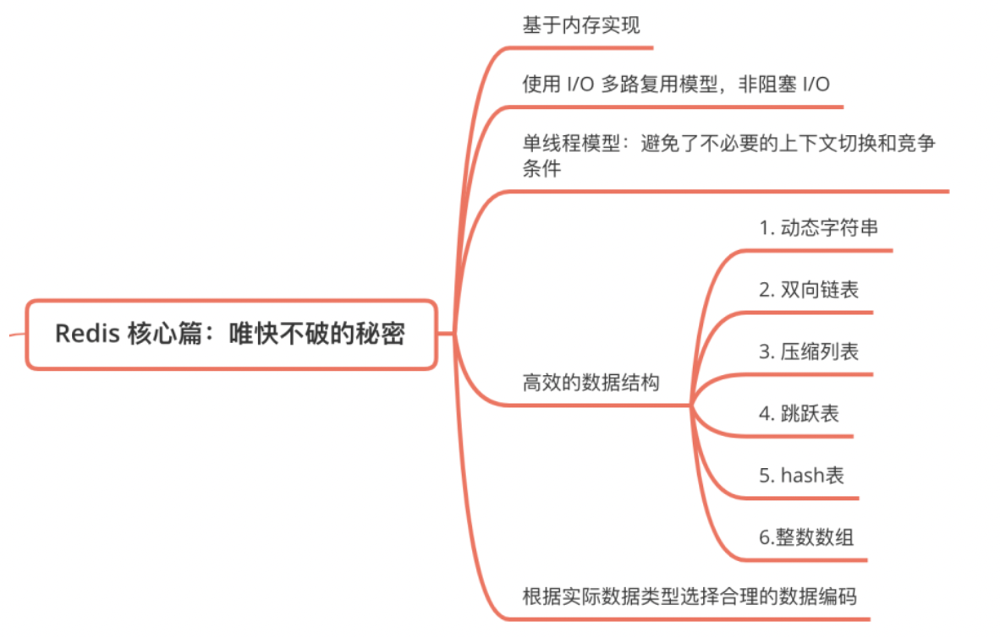

# Redis
```text
系统维度：可以归类为三高

高性能：线程模型、网络 IO 模型、数据结构、持久化机制；
高可用：主从复制、哨兵集群、Cluster 分片集群；
高拓展：负载均衡
```

## 使用docker搭建
M1芯片
```shell
docker run -p 16379:6379 --name redis-home -d arm64v8/redis:7.2-alpine
```

Linux

````shell
docker run -p 16379:6379 --name redis-home -d redis:6.2.3
````

访问本地redis

```shell
docker exec -it redis-home redis-cli
```

## 基本数据结构
### 全局哈希表 & 渐进式rehash
Redis 整体就是一个哈希表来保存所有的键值对。哈希桶中的元素保存的并不是值本身，而是指向具体值的指针。哈希桶中的 entry 元素中保存了*key和*value指针，分别指向了实际的键和值。


哈希表的最大好处，就是让我们可以用 O(1) 的时间复杂度来快速查找到键值对

为了高效和redis rehash不停顿，redis采用了渐进式rehash
```text
Redis 默认使用了两个全局哈希表：哈希表 1 和哈希表 2。一开始，当你刚插入数据时，默认使用哈希表 1，此时的哈希表 2 并没有被分配空间。

随着数据逐步增多，Redis 开始执行 rehash，这个过程分为三步：

1. 给哈希表 2 分配更大的空间，例如是当前哈希表 1 大小的两倍；

2. 把哈希表 1 中的数据重新映射并拷贝到哈希表 2 中；

    拷贝数据时，Redis 仍然正常处理客户端请求，每处理一个请求时，从哈希表 1 中的第一个索引位置开始，顺带着将这个索引位置上的所有 entries 拷贝到哈希表 2 中；
    

3. 释放哈希表 1 的空间。
```


巧妙地把一次性大量拷贝的开销，分摊到了多次处理请求的过程中，避免了耗时操作，保证了数据的快速访问。

一共有5种基础的数据结构：


### String字符串
底层数据结构是：简单动态字符串。如果字符串长度小于1M时，扩容都是加倍现有空间；超过1M，每次扩容只加1M。最大长度是512M

```text
struct sdshdr {
    // 记录SDS所保存的字符串长度
    int len;
    // 记录buf数组中未使用字节的数量
    int free;
    // 字节数组，用于保存字符串
    char buf[];
}
```

命令使用

```shell
# 键值对：存值、取值、判断存在、删除值
127.0.0.1:6379> set name q1
OK
127.0.0.1:6379> get name 
"q1"
127.0.0.1:6379> exists name
(integer) 1
127.0.0.1:6379> del name
(integer) 1
127.0.0.1:6379> get name
(nil)

# 批量操作
127.0.0.1:6379> mset k1 v1 k2 v2 k3 v3
OK
127.0.0.1:6379> mget k1 k2 k3
1) "v1"
2) "v2"
3) "v3"

# 设置key过期 
## k3存在，设置k3 10秒过期
127.0.0.1:6379> expire k3 10
(integer) 1
## 如果key不存在就创建
127.0.0.1:6379> setex k4 10 v4
OK
```

### List列表
在版本3.2之前，列表底层的编码是ziplist和linkedlist实现的，但是在版本3.2之后，重新引入quicklist。

ziplist是Redis节省内存而开发的数据结构。定位第一个元素和最后一个元素，可以通过表头三个字段的长度直接定位，复杂度是 O(1)。而查找其他元素时，只能逐个查找，此时的复杂度就是 O(N)，是一种时间换空间的方案。

ziplist 在表头有三个字段 zlbytes、zltail 和 zllen，分别表示列表占用字节数、列表尾的偏移量和列表中的 entry 个数；压缩列表在表尾还有一个 zlend，表示列表结束。


quickList是一个ziplist组成的linkedlist双向链表，是 ziplist 和 linkedlist 的混合体。它将linkedlist按段切分，每一段使用ziplist来紧凑存储，多个ziplist 之间使用双向指针串接起来。

* 双端：链表节点带有 prev 和 next 指针，获取某个节点的前置节点和后置节点的复杂度都是 O（1）。
* 无环：表头节点的 prev 指针和表尾节点的 next 指针都指向 NULL，对链表的访问以 NULL 为终点。

### Hash 哈希 k-v
哈希对象的编码可以是ziplist(压缩列表)或hashtable

> 编码转化

同时以下条件的哈希对象使用ziplist编码，否则使用hashtable

* 哈希对象保存的所有字符串元素的长度都小于64字节。
* 哈希对象保存的元素数量小于512个。

> hash冲突

哈希表使用链地址法解决hash冲突，即冲突的位置上使用单链表

> 渐进式rehash

和全局哈希表一致

动态的负载因子：哈希表的负载因子 = 哈希表已保存的节点/哈希表大小

> 扩容时机

服务器没有执行BGSAVE或BGREWRITEAOF命令，且哈希表负载因子大于等于1

服务器执行BGSAVE或BGREWRITEAOF命令，且哈希表负载因子大于等于5

> 收缩时机

当哈希表负载因子小于0.1时，对哈希表进行收缩操作。

### set
底层的数据结构是 哈希表或整形数组

内部的键值对是无序的唯一的

#### 整形数组
```text
typedef struct intset{
     //编码方式
     uint32_t encoding;
     //集合包含的元素数量
     uint32_t length;
     //保存元素的数组
     int8_t contents[];
}intset;
```


### zset（有序列表）
底层是zipList或跳表

skiplist 跳跃表是一种有序数据结构。跳表在链表的基础上，增加了多层级索引，通过索引位置的几个跳转，实现数据的快速定位。


### RedisObject
redis有动态字符串sds、双端列表linkedlist、压缩列表ziplist、跳表、哈希表hash、整形数组，但是redis为了加快读写速度并没有直接使用这些数据结构，而是又在上面包装了一层RedisObject

redis中的每一个value都可以理解为是一个RedisObject。可以理解为全局哈希表中值存的是RedisObject，其中存着指针指向具体的数据
```C
typedef struct redisObject {

    // 对象类型
    unsigned type:4;

    // 对象编码
    unsigned encoding:4;

    // 存储最后一次使用次对象的时间等信息
    unsigned lru:LRU_BITS; /* lru time (relative to server.lruclock) */

    // 记录对象引用次数
    int refcount;

    // 指向底层数据结构的指针
    void *ptr;

} robj;
```
* type 对象属性


* encoding属性
encoding存储当前值对象底层编码的实现方式。不同type对象对应不同的编码。

String：int类型编码，embstr类型编码，raw编码。int类型编码：-2^63-2^63 -1整数；embstr：小于44字节的字符串；raw：长度超过44字节的字符串
```text
127.0.0.1:6379> mset k1 123 k2 111111111111111111111111111111111111111111111 k3 v3
127.0.0.1:6379> object encoding k1 
"int"
127.0.0.1:6379> object encoding k2
"raw"
127.0.0.1:6379> object encoding k3
"embstr"
```

* lru属性
当redis内存回收算法设置为volatile-lru或者allkeys-lru时候redis会优先释放最久没有被访问的数据。

## 其他数据结构

> 二值状态统计；
> 聚合统计；
> 排序统计；
> 基数统计

### Bitmap（二值状态统计）
Bitmap 底层数据结构用的是 String 类型的 SDS；可以抽象看成是一个bit为单位的数组，数组的每个单元只能存储0或1，使用offset当作下标。

一个字节中8个bit位利用起来，极大的节省了空间


```text
如果使用String类型的话，首先每个value是RedisObject会占一堆空间，RedisObject的*ptr指向的最终底层的String地址，但是String自身的实现就有len、alloc分别又占了4个字节。
如果现在使用Bitmap就相当与使用了一个String,极大的节约了空间。
```

当我们遇到的统计场景只需要统计数据的二值状态，比如用户是否存在、 ip 是否是黑名单、以及签到打卡统计等场景就可以考虑使用 Bitmap。 只需要一个 bit 位就能表示 0 和 1。在统计海量数据的时候将大大减少内存占用。

* 判断用户登陆态
```shell
# 塞入状态
SETBIT <key> <offset> <value>
# 用户表中用户表id是1008的用户处于登陆状态
SETBIT user_login_status 1008 1

# 获取状态
GETBIT <key> <offset>
GETBIT user_login_status 1008
```
5000千万个用户最终占用空间大概为：5000千万/8/1024/1024 = 6M

### HyperLogLog（基数统计）
HyperLogLog 是用来做基数统计

HyperLogLog 只会根据输入元素来计算基数，而不会储存输入元素本身，所以 HyperLogLog 不能像集合那样，返回输入的各个元素。

### 聚合统计
#### 交集
求user:u1和user:u2两个set集合的交集
```shell
127.0.0.1:6379> SADD user:u1 A B C D
(integer) 4
127.0.0.1:6379> SADD user:u2 C D E G
(integer) 4
127.0.0.1:6379> SINTERSTORE user:u1_u2 user:u1 user:u2
(integer) 2
127.0.0.1:6379> SMEMBERS user:u1_u2
1) "C"
2) "D"
```
#### 差集
差集：取一个集合中另一集合没有的元素
```shell
127.0.0.1:6379> SADD user:u1 A B C D
(integer) 4
127.0.0.1:6379> SADD user:u2 C D E G
(integer) 4
127.0.0.1:6379> SDIFFSTORE user:diff user:u1 user:u2
(integer) 2
127.0.0.1:6379> SMEMBERS user:diff
1) "A"
2) "B"
```
### GEO
GEO 功能是用于处理地理位置信息的功能。它提供了一种方便的方式来存储、查询和计算位置信息。

GEO 在 Redis 中以有序集合（Sorted Set）的形式进行存储，其中每个成员都包含一个经度和纬度的坐标。

## IO模型

我们通常说，Redis 是单线程，主要是指：Redis的网络IO和键值对读写是由一个线程来完成的

但Redis的其他功能，比如持久化、异步删除、集群数据同步等，其实是由额外的线程执行的。

### Redis为什么要用单线程？

1. 使用多线程需保障共享资源使用的安全就得有额外的开销
2. 并发访问控制并不容易
3. 系统代码易调试性和可维护性

### Redis为什么那么快？

通常来说，单线程的处理能力要比多线程差很多，但是Redis却能使用单线程模型达到每秒数十万级别的处理能力。

1. Redis 的大部分操作在内存上完成

2. 再加上它采用了高效的数据结构，例如哈希表和跳表

3. Redis采用了多路复用机制，使其在网络IO操作中能并发处理大量的客户端请求，实现高吞吐率。

### 多路复用在redis中的使用


网络IO处理主要有bind/listen、accept、recv、parse 和 send

```text
建立服务器和客户端之间的通信连接，并进行数据的传输和处理。
bind：将套接字绑定到指定的地址和端口，以便服务器可以监听该地址和端口，等待客户端连接。
listen：使套接字进入监听状态，等待客户端连接请求。
accept：接受客户端的连接请求，创建一个新的套接字用于处理与该客户端之间的通信。
recv：从对方接收数据，通常由服务器使用来接收来自客户端的请求或数据。
parse：解析接收到的数据，提取出信息或执行特定操作，具体的解析逻辑和方式根据应用场景而定。
```

socket 网络模型本身支持非阻塞模式。


虽然Redis线程可以不用继续等待，但是总得有机制继续在监听套接字上等待后续连接请求，并在有请求时通知Redis。

redis使用的是 基于多路复用的高性能 I/O 模型

Linux 中的 IO多路复用机制是指一个线程处理多个IO流，就是我们经常听到的 select/epoll 机制

1. 内核会一直监听多个监听套接字和已连接套接字上的连接请求或数据请求。一旦有请求到达，通知Redis线程处理，这就实现了一个Redis线程处理多个IO流的效果。
2. 内核是如何通知给redis线程处理这些请求？select/epoll提供了基于事件的回调机制。


上图就是基于多路复用的Redis IO 模型。图中的多个FD是多个套接字。

在 Redis 使用 epoll 时的事件处理机制和回调机制的过程如下：

```text
1. Redis 创建一个 epoll 对象，并将需要监听的套接字注册到 epoll 中。

2. 内核监听到有事件到达时，会触发相应的事件，并将事件放入事件队列。

3. Redis 进入事件循环（Event Loop），从事件队列中获取事件。

4. 根据事件类型，直接调用相应的处理函数（回调函数）进行事件处理。

5. 处理完当前事件后，Redis 回到事件循环，继续等待下一个事件的到来。
```

因此。redis不会一直阻塞监听或处理套接字，它只需要一直在对事件队列进行处理，回调对应的事件回调函数。所以能及时响应客户端请求，提升Redis的响应性能。

总结一下这个过程中：
* 使用多路复用的网络模型 select/epoll
* 事件回调机制


## 持久化
### AOF日志
redis与mysql相反是后写日志。因为内存写比磁盘写要快很多

AOF里记录的是Redis收到的每一条命令，这些命令是以文本形式保存的。AOF 文件是以追加的方式。AOF日志是主线程写回的

#### AOF三种写回策略
```text
Always，同步写回：每个写命令执行完，立马同步地将日志写回磁盘；

Everysec，每秒写回：每个写命令执行完，只是先把日志写到内存缓冲区，每隔一秒把缓冲区中的内容写入磁盘；

No，操作系统控制的写回：每个写命令执行完，只是先把日志写到内存缓冲区，由操作系统决定何时将缓冲区内容写回磁盘。
```

#### AOF重写机制
> AOF从写让AOF文件变小

AOF 重写机制就是在重写时，Redis根据数据库的现状创建一个新的AOF文件.

当一个键值对被多条写命令反复修改时，AOF 文件会记录相应的多条命令。但是，在重写的时候，是根据这个键值对当前的最新状态，只有一条写入命令。

> AOF重写不会阻塞主线程

主线程会fork出子进程去进行AOF日志重写

1. 拷贝： 子进程将内存中数据拷贝一份给自己，逐一将拷贝的数据写成操作并记录到重写日志中。（在内存中）
2. 写操作处理：即使在AOF重写期间有写操作发生，主线程在正常进行AOF日志功能时，也会在重写日志的缓冲区中记录一份，确保重写日志不会丢失最新的操作。
3. 1中操作完成后，重写日志缓冲区也会被写入新的AOF文件中，保证新AOF文件是数据库最新状态。
4. 切换AOF日志


### RDB内存快照
对Redis来说，它实现类似照片记录效果的方式，就是把某一时刻的数据状态以文件的形式写到磁盘上，也就是快照。
这个快照文件就称为 RDB 文件，其中，RDB就是Redis DataBase的缩写。

RDB 采用二进制 + 数据压缩的方式写磁盘，文件体积小，数据恢复速度快。给全量数据做快照

#### RDB生成快照不阻塞进程，不妨碍redis正常读写**

不阻塞进程：

    Redis 提供了两个命令来生成 RDB 文件，分别是 save 和 bgsave。
    
    save：在主线程中执行，会导致阻塞；
    
    bgsave：创建一个子进程，专门用于写入RDB文件，避免了主线程的阻塞，默认配置。

不妨碍redis正常读写：

    Redis 会借助操作系统提供的写时复制技术（Copy-On-Write, COW），在执行快照的同时，正常处理写操作。

    bgsave 子进程是由主线程 fork 生成的，可以共享主线程的所有内存数据。
    读操作：主线程和 bgsave 子进程相互不影响。
    写操作：如果主线程要修改一块数据，这块数据就会被复制一份，生成该数据的副本。副本被bgsave 子进程写入RDB文件，这个过程中，不影响主线程修改原来数据。

#### 频繁的执行全量快照的成本

1. 会给磁盘带来很大压力，会出现上一个RDB还未执行完，下一个又开始生成，陷入死循环。
2. 子进程从主线程fork出来时，会阻塞主线程。主线程的内存越大，阻塞时间越长

#### 混合使用AOF和RDB

    Redis 4.0 中提出了一个混合使用 AOF 日志和内存快照的方法。简单来说，内存快照以一定的频率执行，在两次快照之间，使用 AOF 日志记录这期间的所有命令操作。
    
    快照避免了频繁 fork 对主线程的影响。AOF日志也只用记录两次快照间的操作，不需要记录所有操作了，不会出现文件过大的情况了，可以避免重写开销。

#### AOF 和 RDB 的选择问题建议

1. 数据不能丢失时，内存快照和 AOF 的混合使用是一个很好的选择；
2. 如果允许分钟级别的数据丢失，可以只使用 RDB；
3. 如果只用 AOF，优先使用 everysec 的配置选项，因为它在可靠性和性能之间取了一个平衡。

#### 为什么主从库间的复制不使用 AOF？
1. RDB文件是二进制文件，无论是要把RDB写入磁盘，还是要通过网络传输RDB，IO效率都比记录和传输AOF的高。
2. 在从库端进行恢复时，用RDB的恢复效率要高于用AOF。

## Redis常见模式

### 主从库数据同步

Redis 提供了主从库模式，主从库之间采用的是读写分离的方式。

**读操作**：主库、从库都可以接收；

**写操作**：首先到主库执行，然后，主库将写操作同步给从库。


#### 为何要采用读写分离的方式？
主从库都可以执行写指令，假如对同一份数据分别修改了多次，每次修改发送到不同的主从实例上，就导致是实例的副本数据不一致了。

#### 主从库间第一次同步

通过 replicaof（Redis 5.0 之前使用 slaveof）命令形成主库和从库的关系。

1. 从库给主库发送 psync 命令，请求数据同步，主库回复后,就开始了。
2. 主库主库执行 bgsave 命令，生成 RDB 文件，传递给从库。从库清空数据库，加载RDB。
3. 从库加载RDB文件过程中，主库将此时请求的写操作记录到 replication buffer。最终发给从库，保证数据的一致性。

#### 主从库间断网络
在 Redis 2.8 之前，从库就会和主库重新进行一次全量复制，开销非常大。

从 Redis 2.8 开始，主从库会采用增量复制的方式继续同步。只会把主从库网络断连期间主库收到的命令，同步给从库。

1. 当主从库断连后，主库会把收到的写操作命令，写入 repl_backlog_buffer。 repl_backlog_buffer 是一个环形缓冲区，主库会记录自己写到的位置（master_repl_offset），从库则会记录自己已经读到的位置（slave_repl_offset）。
2. 连接恢复之后，从库会给主库发送 psync 命令，并把自己当前的 slave_repl_offset 发给主库，主库会判断自己的 master_repl_offset 和 slave_repl_offset之间的差距。 主库把差距之间的命令操作同步给从库就行。
3. 如果要复制内容在repl_backlog_buffer(环形)中已经被覆盖了，那么就不再做增量复制了，而是进行全量复制。

#### 完成第一次同步后，正常运行期间同步
当主从库完成了全量复制，它们之间就会一直维护一个长连接。

使用增量复制的方式同步。repl_backlog_buffer

### 哨兵模式
Redis 主从集群中，哨兵机制是实现主从库自动切换的关键机制

哨兵其实就是一个运行在特殊模式下的Redis进程，主从库实例运行的同时，它也在运行。

哨兵也是多个构成集群提供服务

#### 哨兵的指责
哨兵主要负责的就是三个任务：监控、选主（选择主库）和通知。


##### 监控
哨兵进程，周期性地给所有的主从库发送 PING 命令，检测它们是否仍然在线运行。没有响应标记为下线。

如果对主库ping命令超时，标记为客观下线，防止哨兵进程误判。因此哨兵也会采用多实例组成的集群模式进行部署，组成哨兵集群，一起来判断决策（少数服从多数）。

如果对从库ping命令超时，标记为主观下线

##### 选主
哨兵判定主库下线，开始自动切换主库的流程。

> 选新的主库

哨兵选择新主库的过程称为“筛选 + 打分”。先按照一定的筛选条件，把不符合条件的从库去掉。然后，我们再按照一定的规则，给剩下的从库逐个打分，将得分最高的从库选为新主库。

##### 通知
1. 从库执行replicaof命令，与新主库进行同步
2. 同步客户端与新主库连接


### 切片集群
redis存储当数据量越来越大，redis可能会出现慢或者别的问题。此时就有两个方向的升级：
1. 纵向升级：加CPU，内存，磁盘。但是实体机器是有限制的，且越大，数据备份越大，进程fork就越耗时
2. 横向升级：多实例，各自存储一部分，组成切片集群。


切片集群，也叫分片集群，然后按照一定的规则，把收到的数据划分成多份，每一份用一个实例来保存，多个实例组成一个集群。

数据量分担到每个实例上后，实例生成RDB时，数据量就小了很多，fork子进程一般不会给主线程带来较长时间的阻塞


#### 数据在实例的分布
切片集群是一种保存大量数据的通用机制，可以有不同的实现方案。

从3.0开始，官方提供了一个名为Redis Cluster的方案，用于实现切片集群。方案中就规定了数据和实例的对应规则。

Redis Cluster方案采用哈希槽（Hash Slot）来映射数据和实例的关系。一个切片有16384个哈希槽，将数据存入其中。根据key值按照CRC16算法计算一个16bit的值，然后与16384取模得到哈希槽编号

数据，哈希槽，实例之间关系：

假设有5个哈希槽，3个实例

哈希槽，实例如何映射？
1. 部署Redis Cluster集群时，使用Cluster create命令，让redis自动将哈希槽分配到实例
2. 自己使用cluster addslots命令手动分配将16384个哈希槽分配完

#### 客户端访问切片集群
```text
# -c 参数表示以集群模式连接
redis-cli -c -h <cluster-ip-address> -p <cluster-port>
```
客户端和集群实例建立连接后，实例会把哈希槽的分配信息发给客户端，客户端会缓存到本地。

当删除或者增加实例，为了负载均衡，Redis上的哈希槽在所有实例上面会重新分布。
客户端无法感知到，因此redis Cluster提供了一个MOVED重定向机制。客户端发送读命令没有值相应的值，客户端需要给新实例再发送请求命令。
```shell
# redis集群会返回新实例的地址
GET hello:key
(error) MOVED 13320 172.16.19.5:6379
```

**当哈希槽重新分布过程中，实例数据迁移中，发生客户端访问：**

Slot2正在从实例2 往实例3迁移，key1和key2已经迁移过去，key3和key4还在实例2。客户端向实例2请求key2后，就会收到实例2返回的ASK命令。

**ASK 命令表示两层含义：**
1. 第一，表明Slot数据还在迁移中；

2, 第二，ASK命令把客户端所请求数据的最新实例地址返回给客户端，此时，客户端需要给实例3发送ASKING命令，然后再发送操作命令。

ASK 命令并不会更新客户端缓存的哈希槽分配信息
```shell
GET hello:key
(error) ASK 13320 172.16.19.5:6379
```

## Redis新特性


## 应用

### 缓存token
1. 访问腾讯很多接口需要先请求认证接口获取到token进行认证。每个请求去做这个操作，会频繁访问会被封禁，并且性能有问题，那就缓存token到redis，缓存一次之后都去redis中查找。


## 问题 & 总结归纳
### redis为什么这么快？


```
1. 基于内存操作。
2. 整个 Redis 就是一个全局哈希表，他的时间复杂度是 O(1).Redis采用 渐进式 rehash。
3. Redis 使用的是非阻塞 IO 多路复用。
4. 采用单线程模型，保证了每个操作的原子性，也减少了线程的上下文切换和竞争。
5. 优秀的底层数据结构+数据编码
```