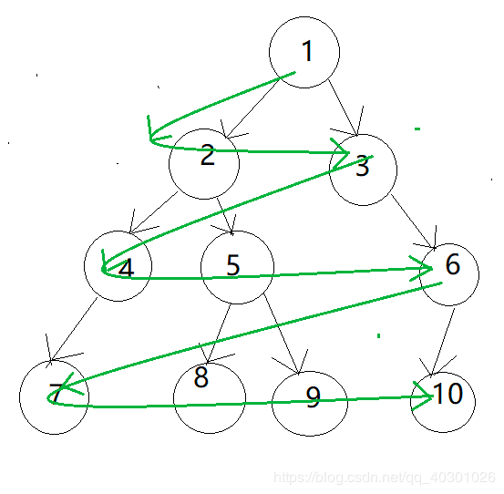
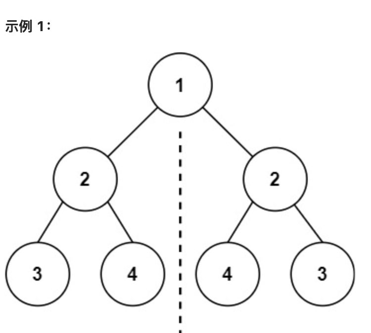
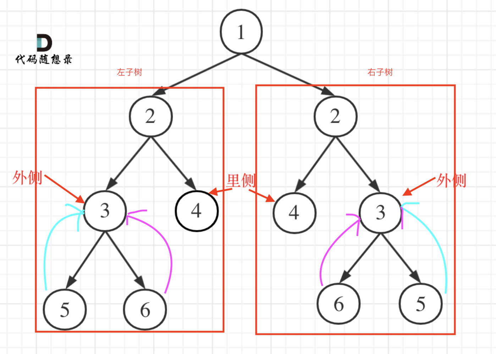

## 二叉树种类
二叉树有两种主要的形式：满二叉树和完全二叉树。
### 满二叉树
如果一棵二叉树只有度为0的结点和度为2的结点，并且度为0的结点在同一层上，则这棵二叉树为满二叉树。  

也可以说深度为k，有2^k-1个节点的二叉树


### 完全二叉树
在完全二叉树中，除了最底层节点可能没填满外，其余每层节点数都达到最大值，并且最下面一层的节点都集中在该层最左边的若干位置。


优先级队列其实是一个堆，堆就是一棵完全二叉树

### 二叉搜索树
二叉搜索树是一个有序树

* 若它的左子树不空，则左子树上所有结点的值均小于它的根结点的值；
* 若它的右子树不空，则右子树上所有结点的值均大于它的根结点的值；
* 它的左、右子树也分别为二叉排序树


### 平衡二叉搜索树
平衡二叉搜索树：又被称为AVL树。且具有以下性质：它是一棵空树或它的左右两个子树的高度差的绝对值不超过1，并且左右两个子树都是一棵平衡二叉树。


## 二叉树的存储方式
**二叉树可以链式存储，也可以顺序存储。**

### 用链表来存储


### 用数组来存储

用数组来存储的规律：如果父节点的数组下标是 i，那么它的左孩子就是 i * 2 + 1，右孩子就是 i * 2 + 2

## 二叉树的遍历方式
### 深度优先遍历
先往深走，遇到叶子节点再往回走。

* 前序遍历（递归法，迭代法）  
根 左 右
* 中序遍历（递归法，迭代法）  
左 根 右
* 后序遍历（递归法，迭代法）  
左 右 根

**一般使用递归来实现**

#### 代码示例
```java
public class Demo {
	private Node root; //树的根结点

	public Demo(Node root) {
		this.root = root;
	}
	
	//先序遍历。     根 左 右
	public void preorder() {
		System.out.println("先序遍历（递归）：");
		carbonPreorder(root);
		System.out.println();
	}
	
	private void carbonPreorder(Node node) {
		if(node!=null) {
			//访问根结点
			System.out.print(node.getData()+" ");
			//遍历左子树
			carbonPreorder(node.getLeftChild());
			//遍历右子树
			carbonPreorder(node.getRightChild());
		}
	}

	//中序遍历。    左  根  右
	public void inorderTraversal() {
		System.out.println("中序遍历(中序)：");
		carbonIT(root);
		System.out.println();
	}
	
	private void carbonIT(Node node) {
		if(node!=null) {
			//遍历左子树
			carbonIT(node.getLeftChild());
			//输出树结点
			System.out.print(node.getData()+" ");
			//遍历右子树
			carbonIT(node.getRightChild());
		}
	}
	
	//后序遍历。    左 右 根
	public void postorderTraversal() {
		System.out.println("后序遍历：");
		carbonPT(root);
		System.out.println();
	}
	
	private void carbonPT(Node node) {
		if(node!=null) {
			carbonPT(node.getLeftChild());
			carbonPT(node.getRightChild());
			System.out.print(node.getData()+" ");
		}
	}
}
```

### 广度优先遍历
一层一层的去遍历。  
层次遍历（迭代法）



**一般使用队列来实现**


核心：利用队列先进后出的特征，先让根结点入队，接着开始循环一下操作，出队，出队的结点左孩子，右孩子入队。直到队列为null
#### 示例
```java

public class Demo {
    public void levelTraversal(Node root) {
        if(root == null) return ;//根为为null结束
        Queue<Node> queue = new LinkedList<>();//建立队列
        queue.offer(root);//根入队列
        System.out.println("层序遍历为：");
        while(queue.size()!=0) {
            int len = queue.size();//统计现在队列元素个数
            for(int i =0; i<len;i++) {
                Node temp = queue.poll();//出队
                System.out.print(temp.getData()+" ");
                if(temp.getLeftChild()!=null) queue.offer(temp.getLeftChild());//左孩子入队
                if(temp.getRightChild()!=null) queue.offer(temp.getRightChild());//右孩子入队
            }
        }
    }
}
```

## 二叉树节点定义
```java
public class TreeNode {
    int val;
    TreeNode left;
    TreeNode right;

    TreeNode() {}
    TreeNode(int val) { this.val = val; }
    TreeNode(int val, TreeNode left, TreeNode right) {
        this.val = val;
        this.left = left;
        this.right = right;
    }
}
```

## 相关题目
### 101. 对称二叉树



#### 思路：  
需要判断一个二叉树是不是镜像对称的，也就是说需要看根节点的左子树和右子树是不是对称的

#### 如何判断左子树和右子树是对称的？  
1. 左子树外侧和右子树外侧相等
2. 左子树内侧和右子树内侧相等

#### 如何实现？
1. 考虑采用深度优先遍历还是广度优先遍历？  

比较根节点左子树和右子树 外侧和内侧应该选择使用深度遍历优先->前序？中序？后序？  

左子树的外侧左节点-右子树的外侧右节点  左子树的内侧右节点-右子树的内侧左节点 是不是相等。 

对于左子树来看就是一直遍历到了底层，然后访问了左，然后访问了右 然后返回  
对于右子树来看就是一直遍历到了底层，然后访问了右，然后访问了左 然后返回  
根据拿到的返回结果，判断左子树和右子树的是否相等  
类似于后序

2. 深度优先遍历二叉树就要使用递归
   递归三部曲
    * 确定递归函数的参数和返回值
    * 确定终止条件
    * 确定单层递归的逻辑

2.1 确认递归参数和返回值   

参数：左子树，右子树 返回值：是否相等  
boolean compare(TreeNode left, TreeNode fight)

2.2 确定终止条件
左节点=null,右节点!=null return false  
左节点!=null,右节点=null return false
左节点=null,右节点=null return true
左节点!=null,右节点!=null,左节点!=右节点 return false

左树=右树 return true

2.3 确定单层递归逻辑
// 比较外侧
boolean outResult = compare(left.left, right.right)
boolean inResult = compare(left.right, right.left)
return outResult == inResult ? true : false

#### 代码
```java
class Solution {
    public boolean isSymmetric(TreeNode root) {
        return compare(root.left, root.right);
    }
    
    public boolean compare(TreeNode left, TreeNode right) {
        // 判断左右子树的根
        if(left == null && right != null) return false;
        if(left != null && right == null) return false;
        if(left == null && right == null) return true;
        if(left.val != right.val) return false;
        // 继续向下比较子节点的左右子树
        boolean resultLeft = compare(left.left, right.right);
        boolean resultRight = compare(left.right, right.left);
        // 比较左右子树，返回结果
        return resultLeft && resultRight;
    }
}
```


